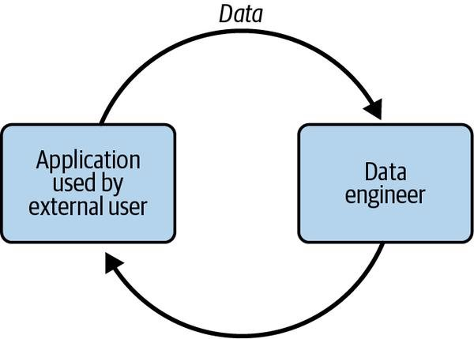

# Qu'est qu'un data engineer

Définition de l'ingénieur de données :
- Développement, mise en œuvre et maintenance de systèmes de gestion de données
- Conversion de données brutes en informations de haute qualité pour l'analyse et l'apprentissage automatique
- Intersection de la sécurité, de la gestion des données, des DataOps, de l'architecture des données, de l'orchestration et de l'ingénierie logicielle
- Gestion du cycle de vie de l'ingénierie des données
- Obtention de données à partir de systèmes sources
- Diffusion de données pour des cas d'utilisation tels que l'analyse ou l'apprentissage automatique

  

## Ingénierie des données et science des données

  

- L'ingénierie des données et la science des données sont distinctes, mais se complètent mutuellement
- L'ingénierie des données se situe en amont de la science des données et fournit les entrées utilisées par les scientifiques des données pour convertir ces entrées en quelque chose d'utile
- Selon Monica Rogati, environ 70-80% du temps des scientifiques des données est consacré à la collecte, au nettoyage et au traitement de données, alors que seulement une petite partie est consacrée à l'analyse et à l'apprentissage automatique
- Dans un monde idéal, les scientifiques des données devraient passer plus de 90% de leur temps sur l'analyse, l'expérimentation et l'apprentissage automatique, tandis que les ingénieurs de données devraient se concentrer sur les couches inférieures de la hiérarchie des données, comme la collecte et le nettoyage, pour fournir une base solide pour la réussite de la science des données en production
- L'ingénierie des données chevauche le fossé entre l'obtention de données et la valorisation de ces données, et joue un rôle important dans la réussite de la science des données en production.

  

## Compétences et activités en ingénierie des données:

- Generation
- Storage
- Ingestion
- Transformation
- Serving
- Sécurité des données: Connaissance des meilleures pratiques de sécurité et de confidentialité des données, y compris la gestion des accès, l'encryptage et la protection contre les attaques.
- Gestion des données: Capacité à gérer et à organiser les données de manière efficace, à mettre en place des processus de qualité des données et à gérer les métadonnées.
- DataOps: Connaissance des meilleures pratiques de livraison de données, y compris la création de pipelines de données, la mise en place de processus de tests et de déploiement et la gestion des environnements de données.
- Architecture des données: Capacité à concevoir et à mettre en place des architectures de données efficaces et évolutives, y compris la définition des modèles de données, la sélection des technologies de stockage et de traitement et la création de systèmes de gestion de la qualité des données.
- Génie logiciel: Compétences en développement logiciel et en informatique distribuée, y compris la programmation, la conception de systèmes et la mise en réseau.
- Optimisation selon les axes du coût, de l'agilité, de l'évolutivité, de la simplicité, de la réutilisation et de l'interopérabilité: Capacité à équilibrer ces différents aspects pour créer des solutions de données efficaces et adaptées aux besoins de l'entreprise.
- Savoir communiquer avec des personnes non techniques et techniques.
- Comprendre comment définir et rassembler les exigences de l'entreprise et des produits.
- Apprenez en continu.
- Orchestration

  

## Maturité de l’entreprise

  

### Étape 1 (Starting with data):*

Entreprise :

- Entreprise peut avoir des objectifs flous, vaguement définis ou aucun objectif.
- L'architecture et l'infrastructure des données en sont aux tout premiers stades de la planification et du développement
- L'équipe de données est petite.
- Les aspects pratiques de la valorisation des données sont généralement mal compris
- Demande Ad hoc

Data Engineer :
- Généraliste jouera plusieurs autres rôles, (data scientist, ingénieur logiciel, etc…)

Erreur :

- Se lancer tête première dans le ML
- Travailler en silos.
- N'enfermez pas votre travail dans une complexité technique inutile.

Objectif :

- Adhésion des principales parties prenantes
- Définir la bonne architecture de données
- Identifiez et auditez les données
- Construire une base de données solide
- Créez des solutions personnalisées et codez uniquement là où cela crée un avantageconcurrentiel.

Point d’attention :

- La volonté organisationnelle peut décliner si de nombreux succès visibles ne se produisent pas avec les données.

### Etape 2 (Scaling with data) :

Dans cette partie, on cherche à rendre l’architecture data scalable Entreprise :

- moins de demande Ad hoc

Data Engineer :

- Spécialistes (Aspects particuliers du cycle de vie de l'ingénierie des données)
Objectif :

- Établir des pratiques de données formelles
- Créer des architectures de données évolutives et robustes
- Adoptez les pratiques DevOps et DataOps
- Créer des systèmes prenant en charge le ML
- Continuez à éviter de soulever des charges lourdes indifférenciées et personnalisez uniquement lorsqu'un avantage concurrentiel en résulte

Erreur :

- Adopter des technologies de pointe basées sur la preuve sociale des entreprises de la Silicon Valley.
- Vous présentez comme un technologue, un génie des données qui peut livrer des produits magiques.

Point d’attention :

- Toutes les décisions technologiques doivent être motivées par la valeur qu'elles apporteront à vos clients
- Concentrez-vous sur des solutions simples à déployer et à gérer pour augmenter le débit de votre équipe.

### Etapes 3 (Leading with data)

Entreprise :

- Axée sur les données
- Pipelines et systèmes automatisés
- Contrôles et des pratiques appropriés pour s'assurer que les données sont toujours disponibles pour les personnes et les systèmes

Data Engineer :

- Spécialiser plus profondément qu'au stade 2

Objectif :
- Créer une automatisation pour l'introduction et l'utilisation transparentes de nouvelles données
- Concentrez-vous sur la création d'outils et de systèmes personnalisés qui exploitent les données comme un avantage concurrentiel
- Se concentrer sur les aspects « entreprise » des données, tels que la gestion des données (y compris la gouvernance et la qualité des données) et DataOps
- Déployer des outils qui exposent et diffusent les données dans toute l'organisation, notamment des catalogues de données, des outils de lignage des données et des systèmes de gestion des métadonnées
- Collaborez efficacement avec les ingénieurs logiciels, les ingénieurs ML, les analystes et autres
- Créer une communauté et un environnement où les gens peuvent collaborer et parler ouvertement, peu importe leur rôle ou leur position

Erreur :

- ne pas concentrer sur la maintenance et l'amélioration et risquer de retomber à un stade inférieur

Point d’attention :

- N'utilisez la technologie sur mesure que lorsqu'elle offre un avantage concurrentiel.

## Les outils fondamentaux :

  

- SQL (Structured Query Language) est l'interface la plus couramment utilisée pour

 les bases de données et les data lakes. Après avoir été temporairement reléguée au second plan par la nécessité d'écrire du code MapReduce personnalisé pour le traitement de grandes quantités de données, SQL (sous diverses formes) est devenue la langue de communication commune des données.

  

- Python est le langage de pont entre l'ingénierie de données et la science des données.

 Un nombre croissant d'outils d'ingénierie de données sont écrits en Python ou ont des API Python. Il est connu comme étant "le deuxième meilleur langage pour tout". Python sous-tend les outils de données populaires tels que pandas, NumPy, Airflow, sci-kit learn, TensorFlow, PyTorch et PySpark. Python est le liant entre les composants sous-jacents et est fréquemment utilisé en tant qu'API de premier plan pour interfacer avec un framework.

  

  

- Les langages JVM tels que Java et Scala sont couramment utilisés dans les projets

 open source Apache tels que Spark, Hive et Druid. La JVM est généralement plus performante que Python et peut offrir un accès à des fonctionnalités de niveau inférieur non disponibles via une API Python (par exemple, c'est le cas pour Apache Spark et Beam). Comprendre Java ou Scala sera bénéfique si vous utilisez un framework de données open source populaire.

  

- bash : une interface en ligne de commande (CLI) utilisée dans les systèmes d'exploitation

 Linux. Connaître les commandes bash et être à l'aise avec les CLIs améliorera significativement votre productivité et votre workflow lorsque vous aurez besoin de scripter ou d'effectuer des opérations de système d'exploitation. Même aujourd'hui, les ingénieurs de données utilisent fréquemment des outils en ligne de commande comme awk ou sed pour traiter des fichiers dans une pipeline de données ou appeler des commandes bash à partir de frameworks d'orchestration. Si vous utilisez Windows, vous pouvez utiliser PowerShell à la place de bash.

Conseil : concentrez-vous sur les fondamentaux pour comprendre ce qui ne va pas changer

 ; prêter attention aux développements en cours pour savoir où va le domaine. De nouveaux paradigmes et pratiques sont introduits tout le temps, et il vous incombe de rester à jour. Efforcez-vous de comprendre comment les nouvelles technologies seront utiles dans le cycle de vie.

## Type de Data engineer :

Les ingénieurs de données ne font pas tous le même type de travail ou n'ont pas le même ensemble de compétences

### Ingénieur de type A (Abstraction) :

Les ingénieurs de données de type A sont ceux qui mettent l'accent sur l'abstraction dans leur travail. Ils cherchent à maintenir une architecture de données aussi simple et abstraite que possible et à ne pas réinventer la roue en gérant des charges lourdes indifférenciées. Ils utilisent principalement des produits, des services gérés et des outils prêts à l'emploi pour gérer le cycle de vie de l'ingénierie des données. Ces ingénieurs de données travaillent dans des entreprises de tous les secteurs et de tous les niveaux de maturité des données.

### Ingénieur de type B (Build) :

Les ingénieurs de données de type B sont ceux qui mettent l'accent sur la construction de outils et de systèmes de données qui tirent parti des compétences de base et de l'avantage concurrentiel d'une entreprise. Ils sont souvent trouvés dans des entreprises aux stades 2 et 3 de maturité des données (mise à l'échelle et leadership avec les données) ou lorsqu'un cas d'utilisation initial des données est si unique et critique qu'il nécessite des outils de données personnalisés pour commencer.

### Interaction avec les données interne et externe :

  

## Un ingénieur de données externe :

S'occupe de la gestion des données pour les applications externes, telles que :

- Les applications de médias sociaux
- Les appareils Internet des objets (IoT)
- Plates-formes de commerce électronique

Ils sont responsables de la conception, de la construction et de la gestion des systèmes qui collectent, stockent et traitent les données transactionnelles et événementielles de ces applications. L'ingénieur de données externe travaille souvent en étroite collaboration avec les équipes de développement d'applications pour s'assurer que les données sont utilisées de manière efficace dans les applications.

  

défis :

- Les moteurs de requête externes sont souvent confrontés à des charges de concurrence beaucoup plus élevées que les systèmes internes.
- La sécurité est également un problème beaucoup plus complexe et sensible pour les requêtes externes, surtout si les données interrogées sont multi-locataires (données de nombreux clients hébergées dans une seule table).

Solution :

- Mettre en place des limites strictes sur les requêtes que les utilisateurs peuvent exécuter pour limiter l'impact sur l'infrastructure d'un seul utilisateur.
- Mettre en place des mesures de sécurité robustes pour protéger les données de différents clients et garantir la confidentialité et l'intégrité des données.

## Un ingénieur de données interne

Un ingénieur de données interne se concentre généralement sur les activités cruciales pour les besoins de l'entreprise et des parties prenantes internes. Parmi ces activités, on peut citer la création et la maintenance de pipelines de données et d'entrepôts de données pour les tableaux de bord de business intelligence (BI), les rapports, les processus métier, la science des données et les modèles d'apprentissage automatique (machine learning, ML). L'ingénieur de données interne travaille souvent en étroite collaboration avec les équipes internes pour s'assurer que les données sont utilisées de manière efficace et que les objectifs de l'entreprise sont atteints.

  

## Interaction avec les autres métiers

  

### Data Architect

Chargés de la conception de la stratégie globale de gestion des données de l'entreprise, en cartographiant les processus et l'architecture des systèmes de données. Pont entre les aspects techniques et non techniques de l'entreprise. . Ils mettent en œuvre des politiques de gestion des données entre les silos de l'entreprise, orientent les stratégies globales de gestion et de gouvernance des données et guident les initiatives importantes. Ils jouent souvent un rôle clé dans les migrations vers le cloud et la conception de nouvelles architectures cloud. Selon la maturité et la taille des données de l'entreprise, un ingénieur de données peut également assumer les responsabilités d'un architecte de données. Les architectes de données sont souvent impliqués dans la conception de couches de données d'application qui sont des sources pour les ingénieurs de données et peuvent interagir avec eux à diverses étapes du cycle de vie de l'ingénierie des données.

### Software engineer

Les ingénieurs logiciels sont responsables de la construction des logiciels et des systèmes qui font fonctionner une entreprise. Ils génèrent souvent des données et des journaux d'événements d'application qui sont utiles pour les ingénieurs de données. Les ingénieurs de données doivent travailler avec les ingénieurs logiciels pour comprendre les applications qui génèrent des données, le volume, la fréquence et le format des données générées et tout ce qui peut avoir un impact sur le cycle de vie de l'ingénierie des données, comme la sécurité des données et la conformité réglementaire. Ilest important que les ingénieurs de données et les ingénieurs logiciels travaillent en étroite collaboration pour s'assurer que les données sont utilisées de manière efficace et que les objectifs de l'entreprise sont atteints.

### DevOps engineers and site-reliability engineers

DevOps et SRE(Site Reliability Engineering) sont deux domaines de l'informatique quisont souvent liés et qui visent à améliorer la qualité et la fiabilité des systèmes informatiques en automatisant les processus de développement et de déploiement. DevOps se concentre sur la collaboration entre les équipes de développement et d'exploitation afin de rendre les processus de déploiement et de mise en production plus efficaces et plus fiables. SREse concentre sur la mise en place de pratiques et de processus pour garantir la fiabilité et la disponibilité des systèmes informatiques.

Les professionnels DevOps et SREproduisent souvent des données grâce au suivi opérationnel, qui consiste à collecter des données sur l'état et les performances des systèmes informatiques. Ces données peuvent être utilisées pour comprendre les problèmes qui se posent et pour améliorer les systèmes. Les ingénieurs de données peuvent également consommer ces données pour construire des modèles de prédiction ou de recommandation qui peuvent être utilisés pour améliorer la qualité et la fiabilité des systèmes informatiques. En outre, les professionnels DevOps et SREpeuvent travailler en étroite collaboration avec les ingénieurs de données pour coordonner les opérations des systèmes de données et pour mettre en place des pratiques efficaces pour la gestion des données.

### Data scientists

Les data scientists sont des professionnels qui utilisent des données pour comprendre

 les tendances et prévoir les comportements futurs. Ils utilisent souvent des techniques de machine learning et d'analyse de données pour construire des modèles qui peuvent être utilisés pour faire des prédictions et des recommandations. Les data scientists passent souvent beaucoup de temps à collecter,nettoyer et préparer des données avant de pouvoir les utiliser pour construire leurs modèles. Cependant, ilest important de noter que cela ne devrait pas être le cas si les ingénieurs de données font leur travail de manière efficace et travaillent en collaboration avec les scientifiques de données.

L'ingénierie des données est une profession qui vise à aider les data scientists à mettre en production leurs modèles de manière efficace. Les ingénieurs de données travaillent souvent en collaboration avec les scientifiques de données pour fournir l'automatisation et l'échelle nécessaires pour rendre la science des données plus efficace. Ils s'assurent que les modèles de data scientists sont prêts pour la production en les déployant de manière fiable et en les maintenant en cours d'exécution de manière fiable. En faisant cela, ils permettent aux data scientists de se concentrer sur l'analyse des données et la construction de modèles de manière plus efficace, plutôt que de passer du temps à collecter,nettoyer et préparer des données.

### Data analysts :

Les analystes de données sont des professionnels qui utilisent des données pour comprendre
les tendances et les performances de l'entreprise. Ils se concentrent généralement sur le passé ou le présent, plutôt que sur l'avenir comme le font les data scientists. Les analystes de données utilisent souvent des outils de gestion de données, tels que SQLet des feuilles de calcul, ainsi que des outils de Business Intelligence (BI)tels que Power BI,Looker ou Tableau, pour analyser et comprendre les données de l'entreprise. Ils sont des experts du domaine des données avec lesquelles ils travaillent fréquemment et se familiarisent intimement avec les définitions, les caractéristiques et les problèmes de qualité des données.

Les ingénieurs de données travaillent souvent en collaboration avec les analystes de données pour créer des pipelines de données pour de nouvelles sources de données requises par l'entreprise. Ils peuvent aider à intégrer ces données dans les systèmes de l'entreprise et à les rendre disponibles pour l'analyse. L'expertise en la matière des analystes de données est inestimable pour améliorer la qualité des données, et ils collaborent souvent avec des ingénieurs de données à ce titre. En travaillant ensemble, les ingénieurs de données et les analystes de données peuvent aider l'entreprise à mieux comprendre ses données et à utiliser cette connaissance pour prendre de meilleures décisions et améliorer ses performances.

### Machine learning engineers :

Les ingénieurs en apprentissage automatique (ML)sont des professionnels de l'informatique qui développent et maintiennent des systèmes de machine learning en production. Ils travaillent souvent avec des frameworks tels que PyTorch ou TensorFlow et sont responsables de la mise en œuvre de processus MLdans un environnement de production à grande échelle. Les ingénieurs MLpeuvent

également avoir des responsabilités opérationnelles sur les systèmes MLet travailler en étroite collaboration avec les ingénieurs de données et les scientifiques de

données pour concevoir des processus MLavancés.

### AI researchers :

Les chercheurs en IA sont des professionnels qui travaillent sur de nouvelles techniques avancées de ML dans des laboratoires de recherche ou dans des entreprises de technologie. Ils peuvent être hautement spécialisés et travailler avec des équipes d'ingénieurs de soutien, ou être moins bien financés et s'appuyer sur des collaborations universitaires pour leur travail.

Les chercheurs en IAsont des professionnels qui travaillent sur de nouvelles techniques avancées de MLdans des laboratoires de recherche ou dans des entreprises de technologie. Ils peuvent être hautement spécialisés et travailler avec des équipes d'ingénieurs de soutien, ou être moins bien financés et s'appuyer sur des collaborations universitaires pour leur travail.
