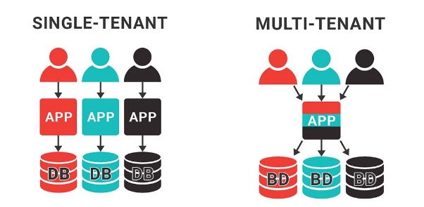
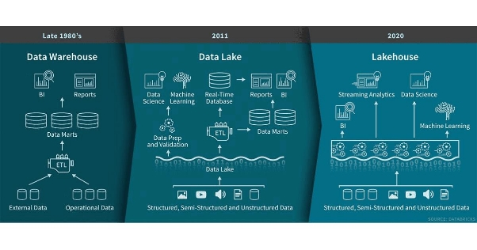

Data Architecture

Qu’est-ce qu’une Data Architecture

L'architecture d'entreprise est la conception de systèmes pour soutenir le changement dans l'entreprise, réalisée par des décisions flexibles et réversibles prises grâce à une évaluation minutieuse des compromis.

*L'architecture des données est la conception de systèmes pour prendre en charge l'évolution des besoins en données d'une entreprise, obtenue par des décisions flexibles et réversibles prises grâce à une évaluation minutieuse des compromis.*

Ne pensez pas à la sélection de la meilleure architecture, mais à la “*moins pire”* car il y aura toujours un compromis.

Privilégier la flexibilité et la réversibilité :

- Le monde change constamment et il est impossible de savoir l'avenir -> ajuster votre cap à mesure que le monde change et que vous recueillez de nouvelles informations
- il existe une tendance naturelle à la rigidité culturelle des entreprises à mesure que les organisations se développent Adopter une culture des décisions réversibles permet de dépasser cette tendance en réduisant le risque attaché à une décision.

Deux types d’architecture :

- opérationnelle
- Technique

L'architecture opérationnelle : Englobe les exigences fonctionnelles de ce qui doit se passer en ce qui concerne les personnes, les processus et la technologie

- à quels processus métier les données servent-elles ?
- Comment l'organisation gère-t-elle la qualité des données ?
- Quelle est la latence requise entre le moment où les données sont produites et le moment où elles deviennent disponibles pour interroger ?

*L'architecture technique* :

décrit comment les données sont ingérées, stockées, transformées et servies tout au long du cycle de vie de l'ingénierie des données.

- Comment déplacerez-vous 10 To de données toutes les heures d'une base de données source vers votre lac de données ?

“Good” Data Architecture

Une bonne architecture de données répond aux besoins de l'entreprise avec un ensemble commun et largement réutilisable de blocs de construction tout en maintenant la flexibilité et en faisant des compromis appropriés, *flexible et facilement maintenable*

Principes d'une bonne architecture de données

Selon Le provider cloud :

- Operational excellence
- Security
- Reliability
- Performance efficiency
- Cost optimization
- Sustainability

Selon Google :

- Design for automation.
- Be smart with state.
- Favor managed services.
- Practice defense in depth.
- Always be architecting.

Les nôtres :

1) Choisissez judicieusement les composants communs.
1) Prévoyez l'échec.
1) Architecte pour l'évolutivité.
1) L'architecture est le leadership.
1) Soyez toujours architectural.
1) Construire des systèmes faiblement couplés.
1) Prendre des décisions réversibles.
1) Priorité à la sécurité.
1) Adoptez le FinOps.

**Choisissez judicieusement les composants communs**

choisir des composants et des pratiques communs qui peuvent être largement utilisés dans une organisation

- stockage d'objets
- systèmes de contrôle de version
- observabilité
- surveillance et les systèmes d'orchestration et moteurs de traitement.

priorisation des composants communs déjà utilisés plutôt que de réinventer la roue

**Planifier en cas d'échec**

*“Tout échoue, tout le temps.”*

*Disponibilité*

Le pourcentage de temps pendant lequel un service ou un composant informatique est dans un état opérationnel.

*Fiabilité*

Le probabilité d'un système de répondre à des normes définies dans l'exécution de sa fonction prévue pendant un intervalle spécifié.

Recovery time objective (RTO)

Ledurée maximale acceptable pour une panne de service ou de système. L'objectif de temps de récupération (RTO) est généralement défini en déterminant l'impact commercial d'une panne. Un RTO d'un jour peut convenir à un système de reporting interne. Une panne de site Web de seulement cinq minutes pourrait avoir un impact commercial négatif important sur un détaillant en ligne.might be fine for an internal reporting system. A website outage of just five minutes could have a significant adverse business impact on an online retailer.

Recovery point objective (RPO)

L'état acceptable après la récupération. Dans les systèmes de données, les données sont souvent perdues lors d'une panne. Dans ce cadre, leL'objectif de point de récupération (RPO) fait référence à la perte de données maximale acceptable.

Doivent être pris en compte lors de la décision des choix architecturaux

**Architecte pour la scalabilité et élastique**

- Les systèmes évolutifs peuvent *évoluer* pour gérer des quantités importantes de données, notre capacité à évoluer nous permet de gérer temporairement des charges extrêmes
- Les systèmes évolutifs peuvent réduire. Une fois que le pic de charge diminue, nous devrions automatiquement supprimer la capacité pour réduire les coûts.

**L'architecture, c'est le leadership**

Cette partie est plus réservée pour les Data Architect, mais c’est bon de le savoir.

Ils possèdent les compétences techniques d'un ingénieur de données mais ne pratiquent plus l'ingénierie de données au quotidien ; ils encadrent les ingénieurs de données actuels, font des choix technologiques judicieux en consultation avec leur organisation et diffusent leur expertise par la formation et le leadership. Ils forment les ingénieurs aux meilleures pratiques et rassemblent les ressources d'ingénierie de l'entreprise pour poursuivre des objectifs communs à la fois en matière de technologie et d'affaires.

En tant qu'ingénieur de données, vous devez pratiquer le leadership en architecture et rechercher le mentorat d'architectes. À terme, vous pourriez bien occuper vous-même le rôle d'architecte.

**Soyez toujours architecte**

le travail de l'architecte est de développer une connaissance approfondie de la architecture de base (état actuel), développer une cibler l'architecture et tracer une plan de séquencement pour déterminer les priorités et l'ordre des changements d'architecture, elle doit être collaborative. L'architecture cible devient une cible mobile, ajustée en réponse aux changements commerciaux et technologiques internes et mondiaux. Le plan de séquençage détermine les priorités immédiates de livraison.

**Construire des systèmes faiblement couplés**

Lorsque l'architecture du système est conçue pour permettre aux équipes de tester, de déployer et de modifier des systèmes sans dépendre d'autres équipes, les équipes ont besoin de peu de communication pour accomplir leur travail. En d'autres termes, l'architecture et les équipes sont faiblement couplées.

Technique :

1) Les systèmes sont divisés en plusieurs petits composants.
1) Ces systèmes s'interfacent avec d'autres services via des couches d'abstraction, comme un bus de messagerie ou une API. Ces couches d'abstraction masquent et protègent les détails internes du service, tels qu'un backend de base de données ou des classes internes et des appels de méthode.
1) En conséquence de la propriété 2, les modifications internes apportées à un composant système ne nécessitent pas de modifications dans d'autres parties. Les détails des mises à jour du code sont cachés derrière des API stables. Chaque pièce peut évoluer et s'améliorer séparément.
1) En conséquence de la propriété 3, il n'y a pas de cycle de libération global en cascade pour l'ensemble du système. Au lieu de cela, chaque composant est mis à jour séparément au fur et à mesure que des modifications et des améliorations sont apportées.

Organisationnel :

1) De nombreuses petites équipes conçoivent un système vaste et complexe. Chaque équipe est chargée de l'ingénierie, de la maintenance et de l'amélioration de certains composants du système.
1) Ces équipes publient les détails abstraits de leurs composants à d'autres équipes via des définitions d'API, des schémas de message, etc. Les équipes n'ont pas besoin de se préoccuper des composants des autres équipes ; ils utilisent simplement l'API publiée ou les spécifications de message pour appeler ces composants. Ils itèrent leur partie pour améliorer leurs performances et leurs capacités au fil du temps. Ils peuvent également publier de nouvelles fonctionnalités au fur et à mesure de leur ajout ou demander de nouvelles fonctionnalités à d'autres équipes. Encore une fois, ce dernier se produit sans que les équipes aient à se soucier des détails techniques internes des fonctionnalités demandées. Les équipes travaillent ensemble à travers *communication faiblement couplée* .
1) Conséquence de la caractéristique 2, chaque équipe peut rapidement évoluer et améliorer sa composante indépendamment du travail des autres équipes.
1) Plus précisément, la caractéristique 3 implique que les équipes peuvent publier des mises à jour de leurs composants avec un temps d'arrêt minimal. Les équipes publient en continu pendant les heures de travail normales pour apporter des modifications au code et les tester.

**Prendre des décisions réversibles**

Le paysage des données évolue rapidement. La technologie ou la pile en vogue d'aujourd'hui est l'arrière-pensée de demain. L'opinion populaire change rapidement. Vous devez viser des décisions réversibles, car elles ont tendance à simplifier votre architecture et à la maintenir agile.

**Prioriser la sécurité**

Responsabilité du provider cloud :

*Le provider cloud est responsable de la protection de l'infrastructure qui exécute les services dans le cloud du provider. Il vous fournit également des services que vous pouvez utiliser en toute sécurité*

Responsabilité de l’utilisateur :

il incombe en dernier ressort à l'utilisateur de concevoir un modèle de sécurité pour ses applications et ses données et d'exploiter les capacités du cloud pour réaliser ce modèle. En tant que data engineer vous devez vous concentrer sur la sécurité des données comme par exemple éviter l’accès des données ouvert au publique, ces services sont accessible directement avec la configuration du provider mais ne doivent pas être oublié car vous en êtes le responsable

**Adoptez le FinOps**

Le *FinOps est une discipline de gestion financière et une pratique culturelle en évolution dans le cloud qui permet aux organisations d'obtenir une valeur commerciale maximale en aidant les équipes d'ingénierie, de finance, de technologie et d'affaires à collaborer sur des décisions de dépenses basées sur les données.*

On-premise :

- les systèmes de données sont généralement acquis avec une dépense en capital
- Le sûr achat entraîne un gaspillage d'argent
- le sous-achat signifie une entrave aux futurs projets de données et un temps considérable du personnel pour contrôler la charge du système et la taille des données

Cloud :

- Les dépenses sont souvent basées à l’utilisation, une action une dépense, pas de gros coûts pour l’achat, mais plus un modèle de location.
- Les dépenses sont plus dynamique mal géré les dépense peuvent excéder le on-prem, d’où l’importance du FinOps

Principaux concepts d'architecture

**Domaines et Services**

Domaine : Le domaine du monde réel pour lequel vous créez une architecture Service : Un ensemble de fonctionnalités dont le but est d'accomplir une tâche

Pour déterminer ce que le domaine doit englober et quels services inclure, le meilleur conseil est simplement d'aller parler avec les utilisateurs et les parties prenantes, d'écouter ce qu'ils disent et de créer les services qui les aideront à faire leur travail. Évitez le piège classique de l'architecture dans le vide.

**Systèmes distribués, évolutivité et conception pour l'échec**

Scalabilité

permet d'augmenter la capacité d'un système à améliorer ses performances et à gérer la demande. Par exemple, nous pourrions vouloir faire évoluer un système pour gérer un taux élevé de requêtes ou traiter un énorme ensemble de données.

Élasticité

La capacité d'un système évolutif à évoluer dynamiquement ; un système hautement élastique peut automatiquement évoluer vers le haut et vers le bas en fonction de la charge de travail actuelle. La mise à l'échelle est essentielle à mesure que la demande augmente, tandis que la réduction permet d'économiser de l'argent dans un environnement cloud. Les systèmes modernes évoluent parfois jusqu'à zéro, ce qui signifie qu'ils peuvent s'arrêter automatiquement lorsqu'ils sont inactifs.

Disponibilité

Le pourcentage de temps pendant lequel un service ou un composant informatique est dans un état opérationnel.

Fiabilité

La probabilité d'un système de répondre à des normes définies dans l'exécution de sa fonction prévue durant un intervalle spécifié.

Les 4 termes sont liés, par exemple peu de scalabilité entraine peu d’élasticité et donc une surcharge au niveau du système qui peut mener à une panne et donc réduire sa disponibilité et par extension à sa fiabilité.

Vertical scaling vs horizontal scaling Vertical scaling :

une des solutions utilisée dans le passé et encore aujourd’hui et le vertical scaling qui consiste à augmenter la puissance d’une machine qui va s’adapter, la principale faiblesse de cette solution et que si cette machine tombe en panne alors tout casse.

Horizontal scaling :

La solution moderne encore utilisé de nos jours est l’horizontal scaling.

Au lieu de ne compter que sur une machine, on va chercher à diviser la tache en plusieurs sous-tâches et chaque sous-tâche sera gérer par une seule machine, si une machine ne marche plus alors une autre pourra prendre le relai évitant les pannes. Une machine se focalisera sur la coordination de toutes ces machines. La principale faiblesse de cette approche et que pour un très grand nombre de machines, il peut être très difficile à mettre en place.

workers node : machine qui exécute les sous-tâches

leader node : machine qui coordonne le reste des machines

**Coupling**

Le coupling est la notion qui définit à quel point les éléments composants votre architecture sont dépendants les uns des autres.

On peut choisir d’avoir une architecture très centralisée (Tight Coupling) ou au contraire très décentralisé (Loose Coupling)

une architecture à faible couplage permet à long terme une architecture très scalable et facilement modifiable dû à la liberté d’action de chaque élément composant l’architecture. Cependant, cela peut engendrer un coût de départ élevé (dur à mettre en place) ça demande une grande maturité technologique et n’est pas forcément intéressant pour les cas simples qui n’auront pas vocation à évoluer ou être plus complexe.

Une architecture à fort couplage est lui très simple à mettre en place et est parfait pour les petit usecase, poc etc… Cependant pour les gros projet aménera à une application avec une dette technique extrémement élevé et à long terme non maintenable qui pousseront à son abandon

l’objectif est de trouver l’architecture qui est un bon compromis entre les deux en fonction du usecase

**Niveaux d'architecture Niveau unique**

est l’architecture la plus couplée, peu importe quel élément tombe en panne, c’est toute l’architecture qui tombe, c’est bien pour les tests, mais à éviter pour la production

**Multi-niveau**

L’architecture à plusieurs niveaux permet de séparer les responsabilités (chaque couche n’a qu’une seule tâche à faire et n’est pas forcément dépendante des autres layers). Dans l’exemple ci-dessus le data layer ne dépend d’aucun layer, le logic layer ne dépend pas du presentation layer, en plus chaque layer peu utiliser la technologie que l’on veut.

Une bonne idée serait d’utiliser en plus de cette architecture pour chaque couche des systèmes distribuée pour réduire les probabilités de panne (par exemple le data layer est important si on utilise une base de données distribuée et/ou une réplication de la base de donnée, les chances de panne de l’architecture deviennent très faibles).

**Monolithes VS Microservices**

Le monolithe est le fait que toute la logique est comprise dans une seule codebase, pas de notion de domaine de service et autre, un cas extrême de monolithe est une architecture à un seul niveau.

Comme on peut le deviner, une application monolithe amène à un manque de modularité (si on veut ajouter, modifier ou supprimer un composant cela peu devenir compliqué) de la dette technique, etc.

L’architecture microservice elle va essayé au mieux de découpler tout ce qui est possible que ça soit les services, les domaines, le code, etc. cette architecture assure que peu importe ce qui tombe en panne, le reste fonctionne.

**Single-Tenant vs Multi-Tenant**

- Plusieurs services d'une grande entreprise partagent-ils le même entrepôt de données ?
- L'organisation partage-t-elle les données de plusieurs gros clients dans la même

table ?

- Une utilisation élevée d'un locataire dégradera-t-elle les performances des autres locataires ?

Considération :

- Les locataires ne doivent pas se connaître et les ingénieurs doivent empêcher les fuites de données

**Event-Driven Architecture**

Event : Sont définis comme des changements d’états de quelque chose

Exemple:

- Une nouvelle commande peut être créée par un client
- Un client peut ultérieurement mettre à jour cette commande

3 étapes :

- La production
- Le routage
- La consommation d'événements

Très utilisé pour les architectures faiblement couplées

**Brownfield Versus Greenfield Projects**

**Brownfield projects**

Il s’agit de reprendre un projet déjà en cours, ce type de projet nécessite une refactorisation et une réorganisation de l’architecture

Considération :

- Compréhension des différents approfondie de l’architecture
- Compréhension de l’interaction entre les différentes technologies

modèle strangler : les nouveaux systèmes remplacent lentement et progressivement les composants d'une architecture héritée. Finalement, l'architecture héritée est complètement remplacée.

Éviter de le faire de manière brutale, il est possible que l’évolution complète de l’architecture s’avère impossible.

**Greenfield projects**

Il s’agit d’un nouveau projet, sans héritage qui laisse davantage de liberté quant aux choix de l’architecture.

Considération :

- s’orienté vers l’utile qui a fait ses preuves et qui a de bons retours sur le marché/communauté et ne pas tendre aux dernières technologies juste pour créer un effet CV

**Exemples et types d'architecture de données**

**Data Warehouse**

*l'entrepôt de données* est un hub de données central utilisé pour le reporting et l'analyse. Les données d'un entrepôt de données sont généralement très formatées et structurées pour les cas d'utilisation analytiques

Deux types d’architecture :

- Organisationnelle : organise les données associées à certaines structures et processus d'équipe commerciale
- Technique : reflète la nature technique de l'entrepôt de données

Pour l’organisationnelle, il y a deux choses à prendre en compte :

- *Sépare le traitement analytique en ligne (OLAP) des bases de données de production (OLTP)*
- *Centralisé et organisé les données*

*Pour l’architecture technique, on s’oriente vers les MPP (Massive processing parallel) qui utilise le même langage que les BDD usuelles, mais optimiser pour le traitement massif de lecture de données pour permettre aux analystes de pouvoir explorer les données sans problématique de latence.*

ETL vs ELT :

L’ETL (Extraction, Transform, Load) est une méthode de traitement de données qui consiste à transformer les données avant de les intégrer dans le data warehouse, L’ELT (Extraction, Load, Transform) consiste à charger dans le data warehouse puis de profiter de la puissance de calcule (MPP) pour faire les transformations pour les exposer.

The cloud data warehouse

Le cloud data warehouse va remplacer le MPP installer on-premise, cette architecture va permettre au entreprise d’éviter une installation de MPP pouvant aller jusqu’à plusieurs millions d’euros à une location du stockage et du cacule.

**Datamarts**

le magasin de données est un sous-ensemble plus raffiné d'un entrepôt conçu pour servir l'analyse et la création de rapports, axé sur une seule sous-organisation, un seul département ou un seul secteur d'activité ; chaque département possède son propre data mart, spécifique à ses besoins

Considération :

- un datamart rend les données plus facilement accessibles aux analystes et aux développeurs de rapports.
- les magasins de données fournissent une étape de transformation supplémentaire au-delà de celle fournie par les pipelines ETL ou ELT initiaux.

Datalake

Le Datalake ressemble grandement à un data warehouse cependant il est beaucoup moins structuré, on peut y mettre n’importe quel type de données, non structuré (image, son, texte..) semi-structuré (JSON, XML, HTML, etc.) et structuré (tabulaire). L’idée première est de stocker les données sans traitement avec l’idée de les utiliser si besoin est.

Cette solution offre une solution à bas coût, mais a un contrecoup. La plupart des entreprises ont stocké leurs données à l’intérieur sans aucune organisation ce qui à conduit à des data swamp, dark data ou encore WORN, on ne sait plus ce qu’il y a dedans. De plus pour les problématiques type RGPD, le droit à l’oublie impose aux sociétés de pouvoir supprimer les données des utilisateurs s'ils l’exigent, difficile si on ne sait pas où elles sont…

Si l’utilisation est poussée dans l’entreprise où vous êtes vous devez être sûr que les données sont bien gérées, heureusement l’émergence de data lakehouse commence à être entreprise.

**Data Lakehouse**

il y a de nouvelles possibilité de gérer les problématiques des datalake par exemple DataBricks à commencer à parler d’un Data lakehouse, il intègre le contrôle et la gestion de données.

Il prend aussi en compte la notion ACID comme les base de données, qui facilite grandement la mise à jour ou la suppression de données contrairement au datalake simple qui est optimisé pour l’écriture

A(Atomicité) : L’atomicité d’une transaction de base de données signifie que tout changement effectué doit être accompli jusqu’au bout. En cas d’interruption, par exemple une perte de connexion au beau milieu de l’opération, le changement doit être annulé et la base de données doit revenir automatiquement à son état antérieur au début de la transaction.

Ce principe permet d’éviter qu’une transaction soit partiellement terminée, à cause d’une panne ou d’un plantage. Dans le cas contraire, il est impossible de savoir à quel niveau d’avancée le processus a été interrompu. D’importantes complications peuvent s’en suivre.

C(Cohérence): La cohérence, ou consistency en anglais, est un principe permettant de garantir qu’une transaction n’enfreigne les contraintes d’intégrité des données fixées pour une database. Ainsi, si la base de données entre dans un état » illégal » en enfreignant ces règles, le processus de transaction sera automatiquement abandonné. La base de données retournera automatiquement à son été antérieur.

I(Isolation) : Une transaction isolée est considérée comme » sérialisable « . Cela signifie que les transactions surviennent dans un ordre successif, plutôt que d’être effectuées en une fois. Toute écriture ou lecture effectuée dans la base de données n’impacte pas l’écriture ou la lecture d’autres transactions survenant sur la même database. Un ordre global est créé, et chaque transaction s’ajoute à une file d’attente. Ce n’est que lorsqu’une transaction est totalement complète que les autres débutent. Cela ne veut pas dire que deux opérations ne peuvent survenir simultanément. Plusieurs transactions peuvent être effectuées en même temps, à condition qu’elles ne puissent pas s’impacter entre elles.

D (Durabilité) : La durabilité est le quatrième principe de l’approche ACID. Il permet d’assurer que tout changement apporté à la base de données soit permanent, même en cas de panne du système. Ceci permet d’éviter que les données soient corrompues ou altérées par une panne de service, un crash ou tout autre problème technique. Pour permettre cette durabilité, on utilise des » changelogs « pris pour références chaque fois que la base de données est redémarrée.

Avec le temps, il y a de grandes chances qu’il y ait une convergence entre le data lake et le data warehouse complète.

**Modern Data Stack**

l'objectif principal de la pile de données moderne est d'utiliser des composants prêts à l'emploi, prêts à l'emploi, faciles à utiliser et basés sur le cloud pour créer une solution modulaire et économique

Ces composants incluent les pipelines de données, le stockage, la transformation, la gestion/gouvernance des données, la surveillance, la visualisation et l'exploration.

Objectif : réduire la complexité et augmenter la modularisation

Dû à sa simplicité d’utilisation les entreprises tendent et tendrons vers ça.

**Architecture lambda**

Même si de moins en moins utilisé comme l’architecture Kappa que nous verrons ci-dessous, il est important de parler de cette architecture qui était grandement utilisé dans le passé.

L’avènement du streaming (traitement de données en temps réel) et des technologies qu’ils l'ont facilitées (Kafka, pub/sub…), on a dû essayer de les réconcilier avec les données batch (lot)

Considération :

- flux batch et streaming fonctionnent indépendamment)
- système source est idéalement immuable
- ajout uniquement
- flux stream sert les données avec le moins de latence possible
- flux batch avec une latence plus grande et bloc

Dans la pratique, concilier les deux flux, c'est avéré difficile et les technologies d’aujourd'hui nous permet de l’éviter.

**Architecture Kappa**

Dans l’architecture Kappa, on considère toutes les données comme faisant partie d’un streaming, en effet même si les données ne sont pas en batch en les lisant partie par partie les lot.

Dans la pratique, cette architecture est peu adoptée :

- Peu de streaming en entreprise, ça fais peur.
- Cette architecture s’avère souvent compliqué et coûteuse en pratique

le stockage et le traitement par lots restent beaucoup plus efficaces et rentables pour d'énormes ensembles de données historiques.
