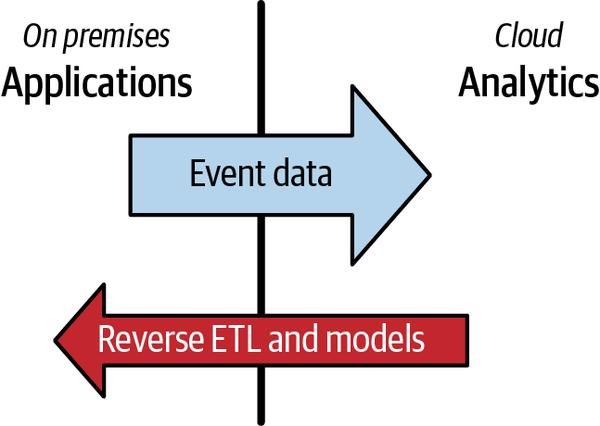
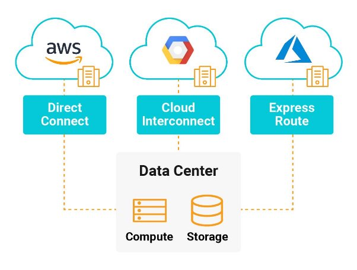
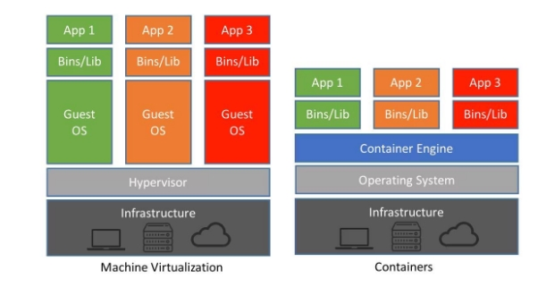

# Choisir les technologies tout au long du cycle de vie de l'ingénierie des données

choisir les bonnes technologies pour servir cette architecture, L'architecture est stratégique ; les outils sont tactiques

L'architecture est la conception, la feuille de route et le plan directeur de haut niveau des systèmes de données qui répondent aux objectifs stratégiques de l'entreprise.

L'architecture est le quoi , le pourquoi et le quand . Des outils sont utilisés pour faire de l'architecture une réalité ; les outils sont le comment .

## Taille et capacités de l'équipe

Si l’équipe est petite, penser à utiliser des technologies simples, car chaque personne sera probablement responsable de plusieurs tâches, elle n’aura pas la bande passante pour plusieurs solutions complexes.

Réfléchir à des solutions en fonction des compétences de l’équipe :

- Les gens penchent-ils vers les outils low-code ou préfèrent-ils les approches code-first ?
- Les gens maîtrisent-ils certains langages comme Java, Python ou Go ?

## La rapidité de commercialisation

choisir les bonnes technologies qui vous aident à fournir des fonctionnalités et des données plus rapidement tout en maintenant des normes de qualité et de sécurité élevées

Le parfait est l'ennemi du bien, offrez de la valeur tôt et souvent

## Interopérabilité

*interopérabilité* décrit comment diverses technologies ou systèmes se connectent, échangent des informations et interagissent. Soyez toujours conscient de la simplicité de connexion de vos différentes technologies tout au long du cycle de vie de l'ingénierie des données

## Optimisation des coûts et valeur commerciale

les budgets et le temps sont finis, et le coût est une contrainte majeure pour choisir les bonnes architectures et technologies de données

## Total Cost of Ownership

*Total cost of ownership* (TCO) est le coût estimatif total d'une initiative

- les coûts directs : directement attribué à une initiative (les salaires, la facture AWS)
- les coûts indirects : indépendants de l'initiative et doivent être payés quel que soit l'endroit où ils sont attribués.

Les dépenses se divisent en deux grands groupes :

- L*es dépenses* en capital , également appelés *capex* , nécessitent un investissement initial. Le paiement est exigé *aujourd'hui*
- *Les dépenses de fonctionnement* , aussi appelés *opex* , sont à certains égards à l'opposé des capex. L'Opex est progressif et étalé dans le temps.

Alors que le capex est axé sur le long terme, l'opex est sur le court terme. Toujours essayer de tendre vers l’opex pour avoir plus de flexibilité

## Total Opportunity Cost of Ownership

*Total opportunity cost of ownership* (TOCO) est le coût des opportunités perdues que nous encourons lors du choix d'une technologie, d'une architecture ou d'un processus, difficile à évaluer, c’est souvent un angle mort.

Lorsque que l’on opte pour une architecture ou un choix technologique on renonce au autre possibilité définir les perte potentiel de cest c’est le TOCO

Toujours essayer d’avoir une vision d’ensemble et surtout éviter à tout prix les technologies qui sont peu flexibles est difficile à changer.

## FinOps

les dépenses cloud typiques sont intrinsèquement opex

## Aujourd'hui contre l'avenir : technologies immuables contre technologies transitoires

Vous devez choisir la meilleure technologie pour le moment et un avenir proche, penser au principe YAGNI (You ain’t gonna need it) est toujours se rappeler que l’avenir à long terme est extrêmement difficile à prédire alors n’essayez pas.

*Les technologies immuables :* peuvent être des composants qui sous-tendent le cloud ou des langages et des paradigmes qui ont résisté à l'épreuve du temps

Exemple :

- cloud object storage
- SQL
- Bash

l'effet Lindy : plus une technologie est implantée depuis longtemps, plus elle sera utilisée longtemps.

*Les technologies transitoires :* sont *Les technologies* qui vont et viennent

  

conseil : Trouvez les technologies immuables tout au long du cycle de vie de l'ingénierie des données et utilisez-les comme base. Évitez de rentrer dans une technologie parce qu’elle est vue comme “jolie” être rationnel et orienté crréation de valeur

  

## On Premises

Il s’agit des entreprises qui n’utilisent pas le cloud, mais uniquement des technologies sur site, souvent les grosses entreprises ou/et hautement régulé ou les sociétés hautement technologiques (ne peut pas se permettre de stocker les données chez une solution concurrentes)

Considération :

- responsables sur le plan opérationnel
- responsables sur le plan matériel et des logiciels (catastrophe naturelle, licenses logiciels, tombe en panne…)
- Les entreprises cloud sont souvent plus agiles

## Cloud

location du matériel et des services gérés auprès d'un fournisseur de cloud (tel qu'AWS, Azure ou Google Cloud).

Considération :

- Ces ressources peuvent souvent être réservées à très court terme (machine démarre rapidement, facturation à la seconde voir moins)
- Scaling rapide et élasticité et souvent auto-géré
- Service de IaaS à SaaS
  - IaaS (Infrastructure as a service) : location d’une machine où on gère toute la configuration (liberté et complexité accrue)
  - PaaS (Pateforme As service) : location d’une machine prête à l’emploi, tout ce dont on a besoin pour une tâche précise est déjà installé et est entretenue par le fournisseur (complexité et liberté réduite)
  - SaaS (Software as a service) : Va plus loin que PaaS, ici, on se contente d’utiliser un logiciel avec une interface utilisateur (Salesforce, Google Workspace, Microsoft 365, Zoom et Fivetran)
  - Abstraction : le SaaS est une abstraction, c'est-à-dire que l’on rend une chose beaucoup plus facile à prendre en main en laissant les détails cacher à l’utilisateur final

## Hybrid Cloud

Suppose qu'une organisation conservera indéfiniment certaines charges de travail en dehors du cloud, il y a plusieurs cas de figure par exemple, on peut avoir une maîtrise dans un domaine donc le garder on-prem et déplacer le reste de la charge vers le cloud.

un bon modèle consiste à transfert toutes les tâche et le stockage de données vers le cloud et garder les app on-prem.

  

## Multicloud

  

il s’agit de d’avoir plusieurs clouds en simultané, le plus souvent il s’agit de tirer le meilleur parti de chaque provider en fonction du besoin Le multicloud peut introduire une complexité importante. Les entreprises doivent désormais gérer une gamme vertigineuse de services sur plusieurs clouds ; l'intégration et la sécurité inter-cloud représentent un défi considérable ; la mise en réseau multicloud peut être diaboliquement compliquée

## Build Versus Buy

Build : L'argument en faveur de la construction est que vous avez un contrôle de bout en bout sur la solution et que vous n'êtes pas à la merci d'un fournisseur ou d'une communauté open source

Buy : L'argument en faveur de l'achat se résume à des contraintes de ressources et d'expertise ; avez-vous l'expertise pour construire une meilleure solution que quelque chose déjà disponible ?

Si possible ne réinventé pas la roue et utilisez des solutions du marché mature qui vous permettront de générer de la valeur

## Open Source Software

*Le logiciel libre* (OSS) est un modèle de distribution de logiciels dans lequel le logiciel et la base de code sous-jacente sont mis à disposition pour une utilisation générale, généralement sous des conditions de licence spécifiques. il est souvent soumis à des licences qui indique ce que vous avez le droit ou non. il existe deux types OSS le Community-managed OSS et le Commercial OSS.

## Community-managed OSS

Ce type d’OSS est souvent gratuit avec un accès au code, il est souvent un très bon choix car la communauté de passionné s’archane à la tâche. Cependant il existe des projets qui peuvent amener à des catastrophes car plus maintenu ou mal coder il faut savoir les choisir.

Considération :

- Évitez d'adopter des projets OSS qui n'ont pas de traction et de popularité.
- Regardez le nombre d'étoiles GitHub, Fork et commits
- l'activité de la communauté sur les groupes de discussion et les forums connexes
- Depuis combien de temps le projet existe-t-il
- Comment devrez-vous gérer les problèmes s'ils surviennent?
- Êtes-vous seul pour résoudre les problèmes ou la communauté peut-elle vous aider à résoudre votre problème ?
- Une entreprise parraine-t-elle le projet OSS ?
- Qui sont les principaux contributeurs ?
- Que fait le projet pour encourager l'utilisation et l'adoption ?
- Existe-t-il une communauté de chat dynamique (par exemple, dans Slack) qui fournit des encouragements et un soutien ?
- etc

## Commercial OSS

Il y a un souci majeur avec les OSS gérés par la communauté, il faut gérer les environnements dans lequel l’environnement évolue, les OSS commerciaux eux permettent en plus de l’OSS d’heberger l’OSS (Souvant en PaaS ou SaaS) pour éviter cette prise de tête.

exemple :

- Databricks pour Spark
- Confluent pour Kafka
- DBT Labs pour dbt

l’une de leur stratégies et de rendre l’OSS gratuit sous forme comme un OSS géré par la communaté, une fois grandement utilisé, on est tenté d’utiliser leur service parce que leurs outils à fait leurs preuves et qu’on veut la solution complète et automanagé.

Considération :

- Le fournisseur offre-t-il une meilleure valeur que si vous gériez vous-même la technologie OSS ?
- Comment accéder au service ?
- Le produit est-il disponible via téléchargement, API ou interface utilisateur Web/mobile ?
- Quel est le modèle de support pour le produit et y a-t-il un coût supplémentaire pour le support ?
- Le fournisseur est-il transparent sur le calendrier de publication, les améliorations et les corrections de bogues ?
- Ces mises à jour sont-elles facilement disponibles pour vous ?
- L'entreprise est-elle viable ?
- L'entreprise se concentre-t-elle sur l'augmentation du nombre de clients (logos) ou essaie-t-elle d'augmenter ses revenus ? Vous serez peut-être surpris par le nombre d'entreprises principalement soucieuses d'augmenter leur nombre de clients, d'étoiles GitHub ou d'adhésion à la chaîne Slack
- L'entreprise soutient-elle vraiment la version communautaire du projet OSS ?
- Combien l'entreprise contribue-t-elle à la base de code communautaire OSS ?
- Quelle est la probabilité que le produit reste viable en tant qu'open source soutenu par la communauté si l'entreprise ferme ses portes ?

## Proprietary Walled Gardens

Certaines des plus grandes entreprises du secteur des données vendent des produits à source fermée, il en existe deux types :

- Independent offerings
- Cloud platform proprietary service offerings

## Independent offerings

Le marché des données est en expansion, il y donc de plus en plus d’outils qui serve à exploité ces données contre facturation, comme dans la plupart des business modèle hors tech ces solution sont fermé (on pas accès au code) et sont diffuser par des tiers qui ne sont pas des providers cloud, ces entreprise peuvent donner accès à des outils excellent mais il faut faire attention lors de leurs selections.

Considération :

- Assurez-vous que l'outil interagit avec les autres outils que vous avez choisis (OSS, autres indépendants, offres cloud, etc.). L'interopérabilité est essentielle, alors assurez-vous de pouvoir l'essayer avant d'acheter.
- La solution est-elle populaire ?
- Présence sur le marché?
- Bénéficie-t-il d'avis positifs de la part des clients ?
- Est-ce clair comment résoudre votre problème, que ce soit par le biais de la documentation ou de l'assistance ?
- Le prix est-il compréhensible ?
- Êtes-vous en mesure de négocier un contrat, accompagné d'une remise ?
- Est-ce que ça vaut le coup?
- L'entreprise survivra-t-elle assez longtemps pour que vous puissiez tirer profit de son produit ?

## Cloud platform proprietary service offerings

Fournisseurs de cloud développent et vendent leurs services propriétaires pour le stockage, les bases de données, etc. On peut prendre l’exemple de DynamoDB de AWS quoi est une BDD NoSQL pour la gestion de données dynamique/semi-structurées

Considération :

- L'offre cloud est-elle nettement meilleure qu'une version indépendante ou OSS ?
- Pouvez-vous réduire vos coûts en achetant de la capacité réservée ou en concluant un contrat d'engagement à long terme ?

## Conseils

- privilégié les OSS ou COSS
- Concentrez-vous sur quelques domaines où la construction de quelque chose ajoutera une valeur significative ou réduira considérablement les frictions

## Monolithe contre modulaire

Les systèmes monolithiques sont autonomes et remplissent souvent plusieurs fonctions sous un seul système. Le camp monolithe privilégie la simplicité d'avoir tout au même endroit.

Le camp *modulaire* se penche vers les technologies découplées et les meilleures de leur catégorie, effectuant des tâches pour lesquelles ils sont particulièrement performants.

## Monolithe

  

- Simple à mettre en place et à comprendre conceptuellement
- Couplé → fragile
- Évolution des versions lente, car tout le système évolue sans que rien doive être cassé
- Passage à un nouveau système difficile
- Codebase tend vers la complexité (tout le code dans un seul endroit)

## Modularité

  

Au lieu de compter sur un monolithe massif pour gérer vos besoins, pourquoi ne pas séparer les systèmes et les processus en leurs domaines de préoccupation autonomes ? Les microservices peuvent communiquer via des API, permettant aux développeurs de se concentrer sur leurs domaines tout en rendant leurs applications accessibles à d'autres microservices.

- Peut-être difficile à mettre en place au début (logiciel et conceptuellement)
- Découplé
- Scalable
- Facilité de mettre à jour le système (service par service)
- Complexité de codebase faible/modéré (chaque service à sa propre codebase)
- Technologie interchangeable (un service Java peut remplacer un service écrit en Python)

## Conseils

- Interopérabilité : Architecte pour le partage et l'interopérabilité.
- Éviter le "bear trap" : Quelque chose dans lequel il est facile d'entrer peut être douloureux ou impossible à échapper.
- La flexibilité : Les choses évoluent si vite dans l'espace des données en ce moment. S'engager dans un monolithe réduit la flexibilité et les décisions réversibles.

## Serverless vs Servers

  

## Serverless

Grande tendance dans le cloud permet au développeur de créer et/ou exécuté leurs applications sans avoir à gérer les serveurs. Bien utiliser cette méthode permet de réduire les coûts, car elle est facturée à l’utilisation alors qu’un serveur lui est payé. En plus de ça, la non-gestion des serveurs augmente la simplicité d’utilisation.

Il faut cependant faire attention aux coûts mal gérés, ça peut mener à des catastrophes.

Considération :

- Comparer les outils serveur et serverless en termes de coût
- Si on utilise du serverless penser en terme d’utilisation seul, ne pas laisser le service tourner et facturer alors qu’il n’est pas essentiel
- Monitoring constant des coûts.
- Est-ce que le service serverless qu’on va utiliser est vraiment orienté vers ce que je veux faire ? les FaaS par exemple ne sont pas du tout prévu pour des exécutions lourdes.

## Containers

  

les conteneurs sont l'une des technologies opérationnelles les plus puissantes et les plus tendances à ce jour. Les conteneurs jouent un rôle à la fois dans les services sans serveur et les microservices.

Les conteneurs sont souvent appelés *machines virtuelles légères* . Alors qu'une machine virtuelle traditionnelle englobe tout un système d'exploitation, un conteneur regroupe un espace utilisateur isolé (tel qu'un système de fichiers et quelques processus) ; de nombreux conteneurs de ce type peuvent coexister sur un seul système d'exploitation hôte. Cela offre certains des principaux avantages de la virtualisation (c'est-à-dire la dépendance et l'isolation

du code) sans la surcharge liée au transport d'un noyau de système d'exploitation complet.

Considération Serverless vs serveur :

- Si on a besoin d’une configuration et/ou de plus de contrôle, tendre vers les solutions serveur (on-prem ou dans cloud en IaaS)
- Le coût
- Attendez-vous à ce que les serveurs tombe en panne, si vous les gérez, vous devez gérer également une solution de backup.
- Que ce soit pour l’un ou l’autre, penser au CI/CD pour réduire la possibilité d’erreur humaine
- Si vous avait besoin d’autoscaling et fléxibité pour la gestion de charge tendre vers le serverless
- Dans la continuité du CI/CD pensé au IaC (Infrastructure as code)
- SI vous avez des tâches plus complexe à géré que ça soit on-prem ou sur le cloud pensez aux containers
- De manière générale sauf besson précis tender vers le serverless car plus simple
