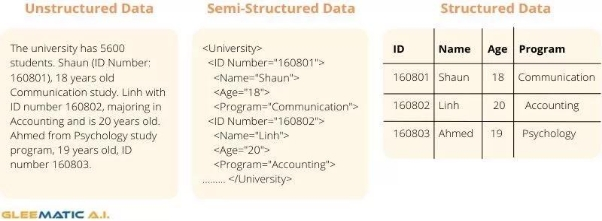

# Génération de données dans les systèmes sources

  

Le but d’un data engineer est de créer de la valeur à partir de données brute, cependant ces données doivent venir de quelque part, l’appellation générique de ces endroits qui fournit des données sont appelées système source.

## Sources de données : comment les données sont-elles créées ?

Les données sont une collection non organisée et sans contexte de faits et de chiffres. Il peut être créé de plusieurs façons, à la fois analogiques et numériques.

Les données analogiques sont produites comme le discours vocal, la langue des signes, l'écriture sur papier ou la pratique d'un instrument. Ces données analogiques sont souvent transitoires

*Les données numériques* sont soit créé en convertissant des données analogiques sous forme numérique ou est le produit natif d'un système numérique.

Exemple d'analogique à numérique est une application de SMS mobile qui convertit la parole analogique en texte numérique.

Un exemple de création de données numériques est une transaction par carte de crédit sur une plateforme de commerce électronique.

## Systèmes sources : idées principales

## Fichiers et données non structurées

  

un fichier est une séquence d'octets, généralement stockée sur un disque. Les applications écrivent souvent des données dans des fichiers. Les fichiers peuvent stocker des paramètres locaux, des événements, des journaux, des images et de l'audio. les fichiers sont un support universel d'échange de données, ces données sont partout dans le monde réel.

La plupart des formats que vous rencontrerez lors de votre carrière sera :

- Structuré :

  

- Excel
- CSV
- Semi-structuré

  

- CSV
- JSON
- XML
- Non-structuré :
  - TXT
  - CSV (Encore une fois)

  

- Développement, mise en œuvre et maintenance de systèmes de gestion de données
- Conversion de données brutes en informations de haute qualité pour l'analyse et l'apprentissage automatique
- Intersection de la sécurité, de la gestion des données, des DataOps, de l'architecture des données, de l'orchestration et de l'ingénierie logicielle Api

  

Une API (Application Programming Interface) est un ensemble de règles et de spécifications qui définissent comment les différents logiciels et systèmes peuvent communiquer entre eux. Les APIs permettent aux développeurs de créer des applications qui interagissent avec des services ou des bases de données externes.

Exemple :

- Utiliser les APIs de réseaux sociaux pour intégrer les fonctionnalités de ces réseaux (partage de publications, récupération des informations sur les utilisateurs) dans une application.
- Utiliser les APIs de services de géolocalisation pour intégrer la localisation dans une application mobile.
- Utiliser les APIs de services de paiement pour permettre aux utilisateurs de faire des achats en ligne via une application.
- Utiliser les APIs de moteurs de recherche pour intégrer des résultats de recherche dans une application.

En principe, une API est censé faciliter le travail des data engineers. En pratique, cela est moins vrai, car les APIs donne beaucoup de liberté à ceux qui la développe et donc ceux qu’ils l’utilisent peuvent avoir des difficultés avec des documentations exotiques voir inexistante.

**Base de données d’application (OLTP)**

  

Une base de données est un système de gestion de données qui permet de stocker, organiser et accéder à des informations de manière efficace. Elle est généralement utilisée pour stocker des informations structurées, telles que des données client, des informations sur des produits ou des transactions financières.

OLTP signifie "OnLine Transaction Processing" (traitement des transactions en ligne). Une base de données OLTP est un type de base de données relationnelle conçue pour gérer un grand nombre de transactions rapides et simples, telles que les ajouts, les suppressions et les mises à jour de données. Les bases de données OLTP sont habituellement utilisées pour stocker les données opérationnelles courantes d'une entreprise, comme les données de ventes, les données de production, les données de comptabilité, les données de personnel, etc.

Les OLTP reflète l'état actuel d’une entité (entreprise par exemple) elles sont performantes écriture, mais pas en lecture, ce n’est pas forcément l’outil à privilégier pour l’analyse

**ACID**

Les principes ACID sont un ensemble de règles qui définissent les caractéristiques d'une base de données fiable et efficace. Les lettres ACID signifient :

- Atomicité : Une transaction est atomique si elle est soit entièrement réalisée, soit entièrement annulée. Cela signifie que si une transaction est interrompue à mi-parcours, toutes les modifications apportées par la transaction sont annulées. Cela évite les incohérences dans les données de la base de données si une transaction est interrompue à mi-parcours. Elle protège contre les opérations incomplètes ou partielles qui pourraient altérer la consistance de la base de données.
- Cohérence : Une transaction est cohérente si elle respecte les contraintes définies pour la base de données, telles que les clés étrangères et les valeurs nulles. La cohérence est importante, car elle garantit que les transactions respectent les contraintes définies pour la base de données, telles que les clés étrangères et les valeurs nulles. Elle

protège contre les actions qui pourraient causer des incohérences dans les données de la base de données, comme l'ajout d'une clé étrangère qui pointe vers une valeur qui n'existe pas ou la modification d'une colonne qui ne doit pas contenir de valeurs nulles.

- Isolation : Les transactions sont isolées les unes des autres, ce qui signifie qu'une transaction en cours n'est pas affectée par les autres transactions en cours. L'isolation est importante, car elle garantit que les transactions sont isolées les unes des autres. Cela empêche les conflits entre les transactions en cours qui pourraient causer des incohérences dans les données de la base de données. Elle protège contre les effets de transactions en cours sur les autres transactions en cours.
- Durabilité : Les données modifiées par une transaction sont permanentes et restent en place même en cas de pannes de courant ou de crash du système. La durabilité est importante, car elle garantit que les données modifiées par une transaction sont permanentes et restent en place même en cas de pannes de courant ou de crash du système. Cela empêche la perte de données critiques et permet de conserver une trace des transactions effectuées. Elle protège contre les pertes de données qui pourraient être causées par des pannes de courant ou des erreurs logicielles.

**Transactions atomiques**

Une transaction dans une base de données est un ensemble d'opérations logiques qui ont un début et une fin, et qui sont exécutées ensemble comme une unité atomique.

Les opérations logiques peuvent inclure des requêtes SQL pour insérer, mettre à jour ou supprimer des données, ou des procédures stockées.

Une transaction peut impliquer plusieurs opérations qui sont toutes effectuées avec succès, ou aucune opération si une erreur survient.

Une fois qu'une transaction est terminée, les modifications apportées aux données sont permanentes et visibles pour les autres transactions. Les transactions sont utilisées pour garantir l'intégrité des données dans la base de données et pour gérer les interactions concurrentes.

Par exemple, si plusieurs transactions en cours modifient les mêmes données, les systèmes de gestion de bases de données utilisent des algorithmes de verrous pour garantir que les transactions soient exécutées de manière à éviter les conflits. Les transactions sont généralement utilisées pour les opérations courantes comme les ajouts, les suppressions et les mises à jour de données dans une base de données OLTP.

**Online Analytical Processing System**

Un système OLAP (Online Analytical Processing) est conçu pour exécuter des requêtes d'analyse volumineuses et est généralement inefficace pour gérer les recherches d'enregistrements individuels, la plupart du temps, elles réunissent plusieurs données issues de différente source (souvent plusieurs OLTP) pour avoir une vision multidimensionnelle.

L’OLAP est optimisé pour la lecture et donc très prisé pour les problématiques d’analyse et data science. Dans la majorité des cas, les OLAPs servent surtout de Datawarehouse et donc sont le point d’arrivée des data engineers, mais avec la popularisation de ETL inversé, il est possible que vous en rencontriez en tant que source de données.

**Change Data Capture**

  

Le Change Data Capture (CDC) est une technique utilisée pour capturer et répliquer les modifications apportées aux données d'une source en temps réel, pour les propager vers une cible.

Il permet de synchroniser les données d'une base de données principale avec les copies de celle-ci dans différents systèmes pour assurer l'intégrité des données.

Il y a plusieurs cas d'utilisation courants pour CDC :

- La réplication de données : Utilisé pour maintenir des copies de données à jour dans différents systèmes pour assurer la haute disponibilité et la tolérance aux pannes.
- L'analytique en temps réel : Utilisé pour alimenter des systèmes d'analyse de données en temps réel en synchronisant les données avec des cubes OLAP ou des systèmes de gestion de données big data.
- La migration de données : Utilisé pour migrer les données d'une source vers une cible en synchronisant les modifications apportées aux données dans la source avec les données dans la cible.
- L'intégration de données : Utilisé pour synchroniser les données entre différents systèmes pour assurer l'intégrité des données et éviter les incohérences.
- La surveillance de données : Utilisé pour surveiller les données pour détecter les anomalies ou les activités suspectes.

**Logs**

  

un log capture les informations sur les événements qui se produisent dans les systèmes. Par exemple, un journal peut capturer le trafic et les modèles d'utilisation sur un serveur Web. Le système d'exploitation de votre ordinateur de bureau (Windows, macOS, Linux) enregistre les événements au démarrage du système et lorsque les applications démarrent ou se bloquent, par exemple. Les journaux sont une source de données riche, potentiellement précieuse pour l'analyse des données en aval, le ML et l'automatisation.

Exemple de système qui utilise des logs :

- Systèmes d'exploitation
- Applications
- Les serveurs
- Conteneurs
- Réseaux
- IoT

les logs de manière générale répondent à minimas à trois questions :

- Qui ? (Humain, système, programme ?)
- Quand ? (horodatage)
- Quoi ? (Qu’est ce que c’est passé ?)

Exemple :

  

Ces sorties de console sont souvent converties en fichier pour être stocké et consulté ultérieurement

Les logs ont principalement 3 formes :

- binaire
  - Pas lisible pour l’Humain, mais facile à transporter dans les réseaux, il nécessite un outil de pour rebasculer dans une version que l’humain peut comprendre
- Semi-stucturé : JSON, XML, etc.
  - La forme semi-structuré est lisible par la machine et l’humain, cependant elle n’est pas aussi facile à transporter que le binaire (moins compressé, consomme plus de bande passante) de plus comme tous les fichiers non structurés, on ne connait pas forcément la profondeur du log → difficultés à retrouver les valeurs qui nous intéressent, code personnalisé nécessaire pour accéder aux bons champs
- Non-structuré : Texte
  - Facile à lire pour l’humain, mais quasiment impossible à utiliser pour la machine

**Logs pour les bases de données**

Les Logs des bases de données ont un rôle encore plus spécifique et critique, ils sont encodés en binaire et permettent si jamais la BDD venait à être perdu à la reconstruire, en effet comme tous les types de transaction sont enregistrés, cette opération de backup est possible. Ces mêmes Logs servent pour les CDC que nous avons vu précédemment.

  

**CRUD**

Signifie *create* , *read* , *update* et *delete* , est un modèle transactionnel couramment utilisé en programmation et représente les quatre opérations de base du stockage persistant. ce modèle est couramment utilisé dans le SQL et les API (HTTP dans le tableau ci-dessous)

  

**Insert-Only**

Historise directement dans une table contenant des données. Plutôt que de mettre à jour les enregistrements, les nouveaux enregistrements sont insérés avec un horodatage indiquant quand ils ont été créés, on n'est pas vraiment dans un modèle CRUD mais plutôt dans une forme de combinaison de base de données & Database logs, car tout l’historique est conservé.

Considération :

- Premièrement, les tableaux peuvent devenir assez volumineux, surtout si les données changent fréquemment
- Le deuxième inconvénient est que les recherches d'enregistrement entraînent une surcharge supplémentaire puisque la recherche de l'état actuel implique l'exécution de MAX(created\_timestamp)

**Messages and Streams**

Contrairement à ce que l’on pense, une message queue et une streaming platform sont deux choses différentes.

Un message correspond aux données brutes communiquées sur deux ou plusieurs systèmes.

  

Un message est généralement envoyé via une message queue, une fois le message livré, il est supprimé de la file d'attente.

  

En revanche, un *stream* est un journal d'enregistrements d'événements en append-only. Au fur et à mesure que des événements se produisent, ils sont accumulés dans une séquence ordonnée avec un horodatage ou un ID pour pouvoir ordonner des événements.

  

Vous utiliserez les stream lorsque vous vous souciez de ce qui s'est passé au cours de nombreux événements. En raison de la nature d'ajout uniquement des stream, les enregistrements d'un stream sont conservés sur une longue fenêtre de conservation (souvent des semaines ou des mois), ce qui permet des opérations complexes sur des enregistrements tels que des agrégations sur plusieurs enregistrements ou la possibilité de revenir à un point dans le temps dans le stream.

Les streams peuvent traiter les messages et que les plateformes de streaming sont fréquemment utilisées pour la transmission des messages. Nous accumulons habituellement des messages dans des stream lorsque nous souhaitons effectuer des analyses de messages.

**Types de temps**

  

Vous souhaiterez enregistrer ces différents temps, de préférence de manière automatisée. Configurez la surveillance le long de vos workflows de données pour capturer quand les événements se produisent, quand ils sont ingérés et traités, et combien de temps, il a fallu pour traiter les événements.

**Détails pratiques du système source**

Maintenant que nous avons vu les différents types de système source, nous allons entrer dans les détails qu’un data engineer doit connaître

**Bases de données**

**Principales considérations pour comprendre les technologies de bases de données**

- *Recherches*

*Comment la base de données trouve-t-elle et récupère-t-elle des données ?*

- *Optimiseur de requête*

*En a t’elle un ? comment fonctionne-t-il ?*

- *Scalabilité & distribution :*

*La base de données est-elle scalable ? Horizontalement ou verticalement ?*

- *Modélisation*

*Quelle est la modélisation la plus efficace pour la base de données en question ?*

- *CRUD*

*Commentles données sont-elles interrogées, créées, mises à jour et supprimées dans la base de données ?*

- *Cohérence*

*a base de données est-elle entièrement cohérente ou prend-elle en charge un modèle de cohérence souple (par exemple, cohérence éventuelle) ?*

**Bases de données relationnelles**

*Le système de gestion de base de données relationnelle* (RDBMS) est l'un des backends d'application les plus courants

Les données sont stockées dans une table de *relations* (lignes), et chaque relation contient plusieurs *champs* (colonnes). Chaque relation du tableau a le même *schéma* (une séquence de colonnes avec des types statiques assignés tels que chaîne, entier ou flottant).

  

Les tables sont généralement indexées par un *clé primaire* , un champ unique pour chaque ligne de la table.

Les tableaux peuvent également avoir divers *clés étrangères* - champs avec des valeurs connectées aux valeurs des clés primaires dans d'autres tables, facilitant les jointures et permettant des schémas complexes qui répartissent les données sur plusieurs tables.

Il est possible de concevoir un *schéma normalisé* . La normalisation est une stratégie pour s'assurer que les données des enregistrements ne sont pas dupliquées à plusieurs endroits, évitant ainsi la nécessité de mettre à jour les états à plusieurs endroits à la fois et évitant les incohérences;.

Les systèmes RDBMS sont généralement conformes à ACID.

**Base de données non relationnelles : NoSQL (Not only SQL)**

Les base de donnée relationnelle était par le passé une solution fourre tout, cependant avec l’avènement du big data, on a commencé à rentrer de nouvelles problématiques.

Prenons les données semi-structuré comme le JSON, dans la majorité des cas ses données sont dynamiques, un ou plusieurs champs s’ajoute, parfois, nous avons des champs dans des champs ce qui augmentent la profondeur de notre objet, comment capturer ces changements si notre base de données relationnelle gère des données avec des schémas fixe ? Il existe des solutions, mais elles sont très souvent plus proches du bidouillage que d’une solution réellement adaptée.

D'une part, la suppression des contraintes relationnelles peut améliorer les performances, l'évolutivité et la flexibilité du schéma. Mais comme toujours en architecture, des compromis existent. Les bases de données NoSQL abandonnent également généralement diverses caractéristiques du SGBDR, telles que la cohérence forte, les jointures ou un schéma fixe.

**Key-value stores**

Une base de données clé-valeur est une base de données non relationnelle qui récupère les enregistrements à l'aide d'une clé qui identifie de manière unique chaque enregistrement.

  

Considération :

- Simplicité de mise en place et d'utilisation : les magasins de clés-valeurs sont traditionnellement très simples à utiliser et à intégrer avec d'autres systèmes.
- Scalabilité horizontale : les magasins de clés-valeurs peuvent gérer de très grandes quantités de données en ajoutant simplement de nouveaux nœuds au système.
- Temps d'accès rapide : les magasins de clés-valeurs sont conçus pour gérer des lectures et des écritures rapides, en utilisant des index de clés pour accéder aux données.
- Pas de contrôle des données : le schéma de données est généralement défini par les applications clientes, ce qui peut entraîner des incohérences de données si les applications ne sont pas correctement conçues.
- Pas de requêtes de jointure : Les magasins de clés-valeurs ne prennent pas en charge les requêtes de jointure, ce qui peut rendre plus difficile la manipulation de certaines données.
- Pas de garantie de consistance : Les magasins de clés-valeurs peuvent gérer la consistance des données de différentes manières, ce qui peut rendre difficile de garantir la consistance des données dans certaines situations

**Document stores**

  

une base de données documents est un magasin clé-valeur spécialisé. Dans ce contexte, un *document* est un objet imbriqué ; nous pouvons généralement considérer chaque document comme un objet JSON. Les documents sont stockés dans des collections et récupérés par clé. Une collection équivaut à peu près à une table dans une base de données relationnelle. L'une des principales différences entre les bases de données relationnelles et les magasins de documents est que ces derniers ne prennent pas en charge les jointures. Cela signifie que les données ne peuvent pas être facilement *normalisées* , c'est-à-dire réparties sur plusieurs tables. Idéalement, toutes les données associées peuvent être stockées dans le même document.

  

Consdération :

- Flexibilité de la structure des données : les magasins de documents permettent de stocker des données non structurées ou semi-structurées, ce qui est utile pour les données qui ont des structures complexes ou qui évoluent fréquemment.
- Requêtes puissantes : les magasins de documents prennent en charge des requêtes avancées, telles que des recherches plein texte, des filtres et des agrégations, ce qui facilite la manipulation des données.
- Performances élevées : les magasins de documents sont conçus pour gérer des lectures et des écritures rapides, en utilisant des index de clés pour accéder aux données.
- Complexité de la gestion des données : les magasins de documents peuvent être plus difficiles à administrer que les bases de données relationnelles ou les magasins de clés-valeurs en raison de la nature non structurée des données.
- Consistance des données : Les magasins de documents peuvent gérer la consistance des données de différentes manières, ce qui peut rendre difficile de garantir la consistance des données dans certaines situations.
- Coûts de stockage : les magasins de documents peuvent nécessiter plus d'espace de stockage pour stocker les mêmes données qu'une base de données relationnelle en raison de la duplication de données qui peut se produire lorsque les données sont stockées sous forme de documents.

**Wide-column**

  

La base de données à larges colonnes est optimisée pour stocker des quantités massives de données avec des taux de transaction élevés et une latence extrêmement faible. Ces bases de données peuvent évoluer vers des taux d'écriture extrêmement élevés et de grandes quantités de données, populaires dans les applications de commerce électronique, de technologie financière, de technologie publicitaire, d'IoT, etc.

Considération :

- Scalabilité : Les systèmes de colonnes larges sont conçus pour gérer des volumes importants de données en parallèle, ce qui les rend adaptés aux grandes quantités de données.
- Flexibilité des schémas : Les systèmes de colonnes larges permettent de définir des schémas de données non structurés, ce qui facilite l'ajout de nouvelles colonnes sans avoir à réorganiser toutes les données existantes.
- Performances élevées pour les opérations de lecture et d'écriture : Les systèmes de colonnes larges sont optimisés pour les opérations de lecture et d'écriture en parallèle, ce qui les rend adaptés aux charges de travail de lecture et d'écriture intensives.
- Complexité accrue: Les systèmes de colonnes larges peuvent être plus complexes à gérer et à maintenir que les systèmes de lignes, en raison de la nature distribuée de ces systèmes.
- Coûts plus élevés: Les systèmes de colonnes larges peuvent nécessiter des coûts de stockage et de calcul plus élevés que les systèmes de lignes en raison de la nécessité de gérer des volumes importants de données en parallèle.
- Moins adapté pour les requêtes JOIN: Les systèmes de colonnes larges ne sont pas aussi efficaces pour les requêtes JOIN que les systèmes de lignes, car ils nécessitent souvent de rechercher les données dans plusieurs colonnes différentes pour répondre à une requête.

**Graph databases**

  

Une base de données graphique est un type de base de données qui utilise des graphes pour stocker et gérer les données. Les graphes sont des structures de données qui permettent de représenter les relations entre les différents objets de données, comme des personnes, des produits, des lieux, etc.

Une base de données graphique est composée de deux éléments principaux: les nœuds et les arêtes. Les nœuds représentent les objets de données, tandis que les arêtes représentent les relations entre les objets de données. Les nœuds peuvent avoir des propriétés, comme un nom ou une adresse, tandis que les arêtes peuvent avoir des propriétés, comme une date ou une distance.

Les bases de données graphiques peuvent être utilisées pour modéliser les relations entre les utilisateurs d'un réseau social, et pour effectuer des requêtes de parcours de graphe pour afficher les relations entre les utilisateurs par exemple.

  

Considération :

- Modélisation des relations: Les bases de données graphiques permettent de modéliser des relations complexes entre les différents objets de données, ce qui les rend adaptées aux modélisations de données basées sur des graphes.
- Performances élevées pour les requêtes de parcours de graphe: Les bases de données graphiques sont optimisées pour les requêtes de parcours de graphe, ce qui les rend adaptées aux charges de travail qui nécessitent de suivre les relations entre les différents objets de données.
- Flexibilité de la structure de données: Les bases de données graphiques permettent de définir des structures de données flexibles, ce qui facilite l'ajout de nouveaux types de relations et de nœuds.
- Complexité accrue: Les bases de données graphiques peuvent être plus complexes à gérer et à maintenir que les bases de données relationnelles ou orientées document, en raison de la nature distribuée et la complexité des relations dans les graphes.
- Moins adapté pour les requêtes de type agrégation: Les bases de données graphiques ne sont pas aussi efficaces pour les requêtes de type agrégation que les bases de données relationnelles, car ils nécessitent souvent de parcourir de nombreux sous-graphes pour répondre à une requête.

**Search**

Une base de données de recherche est un type de base de données qui est conçue pour stocker et rechercher rapidement des données textuelles. Ces bases de données sont souvent utilisées pour stocker des documents, des pages web, des courriers électroniques et d'autres types de données textuelles.

**APIs**

**REST**

  

REST (Representational State Transfer) est un style architectural pour les systèmes distribués basé sur HTTP. Il utilise des méthodes standard HTTP (comme GET, POST, PUT et DELETE) pour interagir avec les ressources sur un serveur. Les ressources sont identifiées par des URI (Uniform Resource Identifiers) et sont généralement représentées en format JSON ou XML. Le but de REST est de fournir une architecture simple et efficace pour les applications distribuées en utilisant les protocoles existants d'Internet.

Considération :

- Utilisation des protocoles standard d'Internet (HTTP)
- Simplicité et flexibilité pour l'interaction avec les ressources
- Utilisation de méthodes standard pour manipuler les ressources (GET, POST, PUT, DELETE)
- Facilité de mise en place de cache et de pare-feu
- Grande capacité à évoluer en utilisant des URI pour identifier les ressources
- Peu de soutien pour les mécanismes de sécurité standardisés
- Peu de soutien pour les protocoles non-HTTP
- Pas de standard pour la description de la structure des ressources

**Webhooks**

  

Un webhook est un mécanisme qui permet à une application de recevoir des notifications lorsqu'un événement spécifique se produit. Il s'agit généralement d'une URL qui est configurée pour recevoir des données lorsqu'un événement est déclenché. Les webhooks sont souvent utilisés pour mettre à jour des données en temps réel, pour envoyer des notifications ou pour déclencher des actions automatisées.

La différence entre les webhooks et les API REST réside dans le sens dans lequel les données sont transmises. Avec une API REST, l'application envoie une requête HTTP pour récupérer des données ou pour effectuer une action. Avec les webhooks, c'est l'application qui reçoit les données lorsqu'un événement spécifique se produit. Les webhooks sont donc plus adaptés pour les applications qui ont besoin de réagir en temps réel à des événements spécifiques, tandis que les API REST sont plus adaptées pour les applications qui cherchent à récupérer ou à envoyer des données de manière proactive.

Considération :

- Mise à jour en temps réel des données : les webhooks permettent de recevoir des notifications lorsqu'un événement spécifique se produit, ce qui permet une mise à jour immédiate des données.
- Automatisation des actions : les webhooks peuvent déclencher des actions automatisées lorsqu'un événement spécifique se produit.
- Simplicité de mise en place : les webhooks sont généralement simples à configurer et à utiliser.
- Fiabilité : les webhooks dépendent de la disponibilité et de la connectivité des serveurs pour fonctionner correctement.
- Sécurité : les webhooks peuvent représenter un risque de sécurité si l'URL de notification n'est pas sécurisée.
- Dépendance de la plateforme : les webhooks peuvent être spécifiques à une plateforme ou à un service, ce qui peut rendre difficile leur utilisation avec d'autres systèmes.

**Data Sharing**

Les concepts de partage de données dans le cloud sont qu'un système multilocataire prend en charge les politiques de sécurité pour le partage des données entre les locataires. Concrètement, tout système de stockage d'objets dans le cloud public doté d'un système d'autorisation à granularité fine peut être une plate-forme de partage de données. Les plates-formes d'entrepôt de données cloud populaires prennent également en charge les capacités de partage de données. Les données peuvent également être partagées par téléchargement ou échange par e-mail, mais un système multi-locataire rend le processus beaucoup plus facile.

**Third-Party Data Sources**

De plus en plus les agences gouvernementales, souhaitent mettre leurs données à la disposition de leurs clients et utilisateurs, soit dans le cadre de leur service, soit dans le cadre d'un abonnement séparé. Par exemple, le Bureau of Labor Statistics des États-Unis publie diverses statistiques sur le marché du travail américain. La National Aeronautics and Space Administration (NASA) publie diverses données issues de ses initiatives de recherche. Facebook partage des données avec des entreprises qui font de la publicité sur sa plateforme.

L'accès direct aux données tierces se fait généralement via des API, via le partage de données sur une plate-forme cloud ou via le téléchargement de données.

**Message Queues and Event-Streaming Platforms**

**Message queues**

  

Une *message queues* est un mécanisme permettant d'envoyer des données de manière asynchrone (généralement sous forme de petits messages individuels, en kilo-octets) entre des systèmes discrets à l'aide d'un modèle de publication (publish) et d'abonnement (subscribe). Les données sont publiées dans une message queue et remises à un ou plusieurs subscriber. Le subscriber accuse réception du message en le retirant de la file d'attente.

Les files d'attente de messages permettent de découpler les applications et les systèmes les uns des autres et sont largement utilisées dans les architectures de microservices. La file d'attente de messages met les messages en mémoire tampon pour gérer les pics de charge transitoires et rend les messages durables via une architecture distribuée avec réplication.

**Ordre et livraison des messages**

Les messages peuvent être publiés et reçus dans le désordre, en particulier dans les systèmes de messagerie hautement distribués. vous devez généralement concevoir pour la livraison de messages dans le désordre.

**Fréquence de livraison**

Les messages peuvent être envoyés une seule fois ou au moins une fois. Si un message est envoyé *exactement une fois* , une fois que l'abonné a accusé réception du message, le message disparaît et ne sera plus remis. [7](https://learning.oreilly.com/library/view/fundamentals-of-data/9781098108298/ch05.html#idm45075125319424) Les messages envoyés *au moins une fois* peuvent être consommés par plusieurs abonnés ou par le même abonné plus d'une fois. C'est très bien lorsque les duplications ou la redondance n'ont pas d'importance.

**Scalabilité**

**Event-streaming platforms**

  

Les plateformes de streaming d'événements sont des systèmes qui permettent de collecter, de stocker et de traiter des stream de données en temps réel, souvent à grande échelle. Ces stream de données peuvent être générés par des sources telles que les capteurs IoT, les applications d'entreprise et les sources de données externes. Les plateformes de streaming d'événements permettent de traiter ces données en temps réel pour des applications telles que l'analyse de données en temps réel, la détection d'anomalies et les systèmes de recommandation. Dans une plate-forme de streaming d'événements, les données sont conservées pendant un certain temps et il est possible de rejouer les messages d'un moment passé.

**Topics**

Dans une plate-forme de diffusion d'événements, un producteur diffuse des événements sur un sujet, une collection d'événements connexes. Un sujet peut contenir des alertes de fraude, des commandes de clients ou des relevés de température provenant d'appareils IoT, par exemple. Un sujet peut avoir zéro, un ou plusieurs producteurs et clients sur la plupart des plateformes de streaming d'événements.

  

Différence avec les messages queue :

- Les plateformes de streaming d'événements se concentrent sur la collecte, le stockage et le traitement des données en temps réel, tandis que les files d'attente de messages se concentrent sur la mise en file d'attente des messages pour un traitement ultérieur.

**Stream partitions**

  

les stream partitions sont des divisions d'un stream en plusieurs stream. Une bonne analogie est une autoroute à plusieurs voies. Le fait d'avoir plusieurs voies permet un parallélisme et un débit plus élevé. Les messages sont distribués sur les partitions par *clé de partition* . Les messages avec la même clé de partition finiront toujours dans la même partition.

Généralement des systèmes distribués, avec des stream stockés sur différents nœuds. Si un nœud tombe en panne, un autre nœud le remplace et le stream est toujours accessible. Cela signifie que les enregistrements ne sont pas perdus ; vous pouvez choisir de supprimer des enregistrements, mais c'est une autre histoire. Cette tolérance aux pannes et cette résilience font des plates-formes de streaming un bon choix lorsque vous avez besoin d'un système capable de produire, de stocker et d'ingérer de manière fiable des données d'événement.
