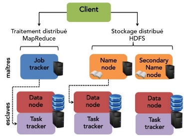

Stockage

Le stockage est la partie du cycle de la data engineering qui intervient dans toutes les phases, par conséquent, elle est très importante. Ici, nous allons rentrer dans les détails dans chaque type de stockage, des éléments bruts aux abstractions que vous utiliserez tous les jours.

**Ingrédients bruts du stockage de données**

Analysons les “Raw ingrédient”

**Magnetic Disk Drive (Lecteur de disque magnétique)**

Un lecteur de disque magnétique est un dispositif de stockage de données qui utilise des platters (disque) magnétiques pour stocker des informations. Il est utilisé pour stocker des fichiers, des programmes et d'autres données sur un ordinateur ou un serveur, les platters tournant sont revêtus d'un film ferromagnétique. Ce film est magnétisé par une tête de lecture/écriture lors des opérations d'écriture pour coder physiquement les données binaires. La tête de lecture/écriture détecte le champ magnétique et produit un flux binaire pendant les opérations de lecture. Vous pourrez souvent les trouver sous le nom de HDD (Hard Drive Disk)

Considération :

- Coût abordable : Les disques durs sont généralement plus abordables que les autres types de dispositifs de stockage tels que les disques durs à semi-conducteur (SSD) et les supports de stockage de données flash.
- Grande capacité de stockage : Les disques durs peuvent stocker des quantités énormes de données, allant de quelques gigaoctets à plusieurs téraoctets.
- Fiabilité éprouvée : Les disques durs sont des dispositifs de stockage de données fiables qui ont été utilisés pendant de nombreuses années dans les ordinateurs et les serveurs.
- Facile à trouver : Les disques durs sont facilement disponibles dans les magasins d'électronique et en ligne.
- Lent à accéder aux données : Les disques durs sont plus lents à accéder aux données que les autres types de dispositifs de stockage tels que les disques durs à semi-conducteur (SSD) et les supports de stockage de données flash.
- Fragilité : Les disques durs sont fragiles et peuvent être endommagés par des chocs, des vibrations ou des mouvements brusques.
- Consommation électrique : Les disques durs consomment plus d'énergie que les autres types de dispositifs de stockage.
- Bruit : Les disques durs peuvent émettre un bruit audible lorsqu'ils tournent, ce qui peut être gênant pour certains utilisateurs.

**Solid-State Drive (SSD)**

Les SSD stockent les données sous forme de charges dans des cellules de mémoire flash. Les SSD éliminent les composants mécaniques des disques magnétiques ; les données sont lues par des moyens purement électroniques.

Considération :

- Vitesse d'accès élevée : Les SSD sont plus rapides que les disques durs traditionnels (HDD) pour accéder aux données, ce qui signifie que les programmes et les fichiers s'ouvrent plus rapidement et que les performances globales de l'ordinateur sont améliorées.
- Fiabilité : Les SSD sont plus fiables que les disques durs traditionnels, car ils n'ont pas de pièces mobiles qui peuvent s'user ou se casser.
- Durée de vie plus longue : Les SSD ont une durée de vie plus longue que les disques durs traditionnels, parce qu'ils peuvent généralement supporter plus de cycles d'écriture/lecture.
- Consommation électrique réduite : Les SSD consomment moins d'énergie que les disques durs traditionnels, ce qui peut prolonger la durée de vie de la batterie des ordinateurs portables.
- Coût élevé : Les SSD sont généralement plus chers que les disques durs traditionnels, ce qui peut les rendre inabordables pour certains utilisateurs.
- Capacité de stockage limitée : Les SSD ont généralement une capacité de stockage moins importante que les disques durs traditionnels, ce qui peut poser des problèmes pour les utilisateurs qui stockent de grandes quantités de données.
- Durée de vie limitée : Les SSD ont une durée de vie limitée en termes de cycles d'écriture/lecture, ce qui signifie qu'ils ne peuvent pas être utilisés indéfiniment.
- Perte de données : Les données stockées sur un SSD peuvent être perdues si le dispositif est endommagé ou s'il perd de l'alimentation, donc il est recommandé de faire des sauvegardes régulières.

**Random Access Memory (RAM)**

La mémoire vive (RAM) est un type de mémoire utilisé pour stocker des données temporairement lorsque l'ordinateur est en cours d'exécution. Il permet à l'ordinateur de stocker des données de manière temporaire pour une utilisation immédiate, tandis que les données sont stockées de manière permanente sur un disque dur ou un autre support de stockage de donnée. La RAM est une mémoire volatile, ce qui signifie qu'elle ne conserve pas les données lorsque l'ordinateur est éteint. Les données stockées dans la RAM sont effacées lorsque l'ordinateur est éteint ou redémarré.

Caractéristique :

- Il offre des vitesses de transfert nettement plus élevées et des temps de récupération plus rapides que le stockage SSD
- Il est attaché à un processeur et mappé dans l'espace d'adressage du processeur
- Il est nettement plus cher que le stockage SSD.
- Il est *volatil.*
- *Il est limité*
- *Il est nettement plus lent que le cache CPU,*

**Le cache CPU (ou mémoire cache)**

*Le cache CPU (ou mémoire cache) est un type de mémoire tampon utilisé pour stocker temporairement les données les plus fréquemment utilisées par le processeur. Il est généralement intégré au processeur lui-même et il est utilisé pour accélérer les performances en réduisant les temps d'accès aux données stockées dans la mémoire vive (RAM).*

*La mémoire cache est divisée en plusieurs niveaux, chacun ayant une capacité de stockage et une vitesse d'accès différente.*

- *Le niveau 1 (L1) cache est le plus proche du processeur et est généralement le plus petit, mais il est également le plus rapide.*
- *Le niveau 2 (L2) cache est un peu plus éloigné du processeur et est généralement plus grand, mais un peu plus lent.*
- *Le niveau 3 (L3) cache est encore plus éloigné du processeur et est généralement encore plus grand, mais il est également encore plus lent.*

*La différence entre le cache CPU et la RAM est que le cache CPU est un type de mémoire tampon utilisé pour stocker temporairement les données les plus fréquemment utilisées par le processeur, tandis que la RAM est utilisée pour stocker temporairement les données utilisées par les programmes en cours d'exécution. Le cache CPU est plus rapide que la RAM, mais il a une capacité de stockage beaucoup plus limitée. La RAM est plus lente que le cache CPU, mais elle a une capacité de stockage beaucoup plus importante.*

**Un processeur (CPU pour Central Processing Unit)**

Un processeur (ou CPU pour Central Processing Unit) est le composant principal d'un ordinateur qui exécute les instructions d'un programme informatique. Il est le "cerveau" de l'ordinateur, qui gère les calculs, les opérations logiques et les instructions de contrôle. Il est responsable de traiter les informations, de les stocker temporairement dans la mémoire vive (RAM) et de les transférer vers d'autres composants comme les HDD et/ou SSD de l'ordinateur pour une utilisation ultérieure.

S'il y a une chose à retenir, c’est que plus un composant mémoire est proche du CPU, plus, il est rapide en lecture/écriture, mais souvent plus cher et limité en capacité de stockage.

**Mémoire pour le data engineer.**

Lors de déploiement d’outils big data distribué, la sélection de composants mémoire sera votre responsabilité. Par exemple, si vous êtes dans un cas où la latence doit être faible, vous devriez vous pencher vers une solution SSD plutôt que HDD en sachant également que plus un processeur à de core plus il a de mémoire cache. La RAM aussi est importante, l’application sera donc beaucoup plus rapide, mais le coût est également plus élevé, il faudra donc trouver le bon compromis.

**Sérialisation**

La sérialisation est le processus de convertir un objet en un flux de données (généralement un tableau binaire ou une chaîne de caractères) qui peut être stocké ou transmis à travers un réseau. Cela permet de conserver l'état d'un objet et de le récupérer plus tard.

Pour faire simple, lorsque vous modifiez un fichier comme Word, il est désérialisé donc sous sa forme modifiable, quand vous sauvegardez ce fichier, il est sous une forme sérialisée que vous pouvez envoyer, partager ou stoker et nécessite un protocole adéquat (dans notre Cas Word) pour être désérialisé et utilisé à nouveau. Cette méthode est applicable pour tout type d’objet informatique et il existe de nombreux protocoles de sérialisation.

Le type de sérialisation choisit à un impact notable pour les étapes en amont. par exemple les bases de données relationnelles orientées lignes organisent les données sous forme de lignes sur le disque pour prendre en charge des recherches rapides et des mises à jour sur

place. Les bases de données en colonnes organisent les données en fichiers de colonnes pour optimiser une compression hautement efficace et prendre en charge des analyses rapides de gros volumes de données. Chaque choix de sérialisation s'accompagne d'un ensemble de compromis, et les ingénieurs de données ajustent ces choix pour optimiser les performances en fonction des besoins.

**Compression**

*La compression* est un autre élément essentiel de l'ingénierie du stockage. À la base, la compression réduit la taille des données, mais les algorithmes de compression interagissent avec d'autres détails des systèmes de stockage de manière complexe.

Une compression hautement efficace présente trois avantages principaux dans les systèmes de stockage.

- les données sont plus petites et occupent donc moins d'espace sur le disque
- la compression augmente la vitesse d'analyse pratique par disque
- Le troisième avantage réside dans les performances du réseau. Étant donné qu'une connexion réseau entre une instance Amazon EC2 et S3 fournit 10 gigabits par seconde (Gbps) de bande passante, un taux de compression de 10:1 augmente la bande passante réseau effective à 100 Gbps

**Systèmes de stockage de données**

Passons au “Storage Sytems”

**Machine unique versus stockage distribué**

On utilise un système de stockage distribué quand les données deviennent trop volumineuses pour être stockées dans une seule machine. Le stockage distribué coordonne les activités de plusieurs serveurs pour stocker, récupérer et traiter les données plus rapidement et à plus grande échelle, tout en offrant une redondance en cas d'indisponibilité d'un serveur. Le stockage distribué est courant dans les architectures où vous souhaitez une redondance et une scalabilité intégrées pour de grandes quantités de données. Par exemple, le stockage d'objets, Apache Spark et data warehouse cloud reposent sur des architectures de stockage distribuées. Le fait d’augmenter la capacité à travers plusieurs machine est ce qu’on appelle une scalabilité horizontale, l’augmenter avec une seule machine est une scalabilité verticale.

La scalabilité horizontale permet d’augmenter les performance de manière “infini” mais peut s’avérer très dur à mettre en place et à coordonner quand le nombre de machines est grand, dans le meilleur cas, on laisse des service cloud se charger de cette étape.

La scalabilité verticale est simple à mettre en place (achat d’une machine plus puissante) mais ne peut pas évoluer à l’infini” et si la machine casse tout est perdu

**Cohérence éventuelle versus forte**

Comment ce système assure-t-il la cohérence des données ? Malheureusement, les systèmes distribués posent un dilemme pour le stockage et la précision des requêtes. Il faut du temps pour répliquer les modifications sur les nœuds d'un système ; il existe souvent un équilibre entre l'obtention de données actuelles et l'obtention de données « en quelque sorte » actuelles dans une base de données distribuée.

Dans ce cas de figure, les données utilisent ce qu’on appelle le système BASE (*basically available, soft-state, eventual consistency)*

- *Basically available*

*La cohérence n'est pas garantie, mais les lectures et écritures de base de données sont effectuées au mieux, ce qui signifie que des données cohérentes sont disponibles la plupart du temps.*

- *Soft-state*

*L'état de la transaction est flou et il n'est pas certain que la transaction soit validée ou non validée.*

- *Eventual consistency*

*À un moment donné, la lecture des données renverra des valeurs cohérentes.*

*Si vous souhaitez effectuer une mise à l'échelle horizontale (sur plusieurs nœuds) pour traiter des volumes de données élevés, la cohérence est souvent le prix à payer. La cohérence éventuelle vous permet de récupérer rapidement des données sans vérifier que vous disposez de la dernière version sur tous les nœuds.*

*Le contraire de la cohérence éventuelle est une cohérence forte . Avec une cohérence forte, la base de données distribuée garantit que les écritures sur n'importe quel nœud sont d'abord distribuées avec un consensus et que toutes les lectures sur la base de données renvoient des valeurs cohérentes. Vous utiliserez une cohérence forte lorsque vous pouvez tolérer une latence de requête plus élevée et exiger des données correctes à chaque fois que vous lisez à partir de la base de données.*

**Stockage d'objets**

Object storage est un type de stockage de données qui permet de stocker des objets (généralement des fichiers) en utilisant une architecture distribuée. Les objets sont organisés dans des "buckets" (conteneurs) et sont accessibles via une interface de programmation d'application (API). Les objets sont identifiés par un identifiant unique et peuvent être stockés sur des serveurs distants, ce qui permet une récupération de données plus rapide et une meilleure tolérance aux pannes. Les principaux avantages de l'object storage sont sa scalabilité, sa fiabilité et sa flexibilité pour gérer les données non structurées.

En outre, de nombreux entrepôts de données cloud (et un nombre croissant de bases de données) utilisent le stockage d'objets comme couche de stockage, et les lacs de données cloud reposent généralement sur des magasins d'objets.

les ingénieurs n'ont pas besoin de prendre en compte les caractéristiques des clusters de serveurs ou des disques sous-jacents. Un magasin d'objets est un magasin clé-valeur pour les objets de données immuables, pour modifier des données dans un objet ou y ajouter des données, nous devons réécrire l'objet complet. Les magasins d'objets prennent en charge des écritures et des lectures de flux parallèles extrêmement performantes sur de nombreux disques.

Les magasins d'objets cloud typiques enregistrent les données dans plusieurs zones de disponibilité, réduisant considérablement les chances que le stockage soit complètement hors ligne ou perdu de manière irrécupérable. Cette durabilité et cette disponibilité sont intégrées dans le coût.

Le stockage d'objets dans le cloud est un ingrédient clé dans la séparation du calcul et du stockage, permettant aux ingénieurs de traiter les données avec des clusters éphémères et de faire évoluer ces clusters à la demande.

Dans un environnement cloud, l'espace de stockage disponible est pratiquement illimité ; en pratique, la principale limite de l'espace de stockage pour les clients du cloud public est le budget

**Recherche d'objet**

le stockage d’objet est un key-value store, contrairement au système fichier, on n’utilise pas de notion d’arborescence pour la recherche d’objet, il faut rechercher la bonne clé pour accéder à la bonne donnée

Exemple AWS S3 :

pour S3://some\_bucket/data-example.json

- S3://some\_bucket/ : est le bucket qui contient la données, Les noms de compartiment S3 doivent être uniques dans tout AWS
- data-example.json : la clé pointant vers le bon objet, Les clés sont uniques dans un compartiment

Malgré les apparences, il n’y a pas d’arborescence, Cela peut sembler être un détail technique mineur, mais les ingénieurs doivent comprendre que certaines opérations au niveau du "répertoire" sont coûteuses dans un magasin d'objets. Si le bucket contient des millions d'objets, cette opération peut prendre un certain temps, même si le "sous-répertoire" ne contient que quelques objets.

**Cohérence des objets et gestion des versions**

Comme mentionné, les magasins d'objets ne prennent pas en charge les mises à jour ou les ajouts sur place en règle générale. Nous écrivons un nouvel objet sous la même clé pour mettre à jour un objet. Dans leur configuration de base les stockages d’objets ont une cohérence éventuelle (au bout d’un moment les bonnes données disponibles) dans le cas d’une nouvelle version cela peut poser des problème si on a besoin des données en temps réel.

**Classes et niveaux de stockage**

Fournisseurs de cloud proposent désormais des classes de stockage qui réduisent les prix du stockage de données en échange d'un accès réduit ou d'une durabilité réduite. Nous utilisons ici le terme *accès réduit*, car bon nombre de ces niveaux de stockage rendent toujours les données hautement disponibles, mais avec des coûts de récupération élevés en échange de coûts de stockage réduits.

Dans cet exemple de GCP (Google cloud platform) on peut voir que chaque à une spécification, par exemple la classe standard, on peut accéder au données quand on le désire sans surcoût, pour les données coldline, on est censé ne récupéré les données qu’une fois par trimestre sans avoir des surcoût.

**Systèmes de stockage basés sur le cache et la mémoire**

un système basé sur la mémoire cache et comme basé sur la mémoire cache et/ou RAM, ça dépend de l’outil, il permet dans une architecture de données et/ou d’application d’avoir accès au données souvent demandé et donc d’avoir une latence très faible.

Mais comme nous l’avons vu plus haut, ce type de mémoire sont très sensibles à la perte de mémoire, il sert plus de support pour que l’application n’ait pas besoin d’aller chercher les données dans la base de données “lente” si elle est déjà présente dans le la base de données in-memory.

**Le système de fichiers distribué Hadoop**

Hadoop est similaire au stockage d'objets, mais avec une différence clé : Hadoop combine le calcul et le stockage sur les mêmes nœuds, où les magasins d'objets ont généralement une prise en charge limitée du traitement interne.

Hadoop décompose les fichiers volumineux en *blocs* , morceaux de données de moins de quelques centaines de mégaoctets. Le système de fichiers est géré par le *NameNode, qui gère les répertoires, les métadonnées des fichiers et un catalogue détaillé décrivant l'emplacement des blocs de fichiers dans le cluster.*

*Dans une configuration typique, chaque bloc de données est répliqué sur trois nœuds. Cela augmente à la fois la durabilité et la disponibilité des données. Si un disque ou un nœud tombe en panne*

Même si de moins en moins utilisé, il existe encore on-premise de nombreuse architecture Hadoop hérité, de plus de nombreux paradigmes de big data se sont inspiré de ce dernier.

**Stockage en continu**

Données en continua des exigences de stockage différentes de celles des données non diffusées en continu.

Dans le cas des files d'attente de messages, les données stockées sont temporelles et censées disparaître après une certaine durée.

Cependant, les frameworks de streaming distribués et évolutifs comme Apache Kafka permettent désormais une conservation des données de streaming extrêmement longue durée. Kafka prend en charge la conservation indéfinie des données en poussant les anciens messages rarement consultés vers le stockage d'objets.

Les concurrents de Kafka (dont Amazon Kinesis, Apache Pulsar et Google Cloud Pub/Sub) prennent également en charge la longue conservation des données.

**Index, partitionnement et clustering**

Index fournir une carte de la table pour des champs particuliers et permettre une recherche extrêmement rapide des enregistrements individuels. Sans index, une base de données devrait parcourir une table entière pour trouver les enregistrements satisfaisant uneWHERE condition.

**Des index aux partitions et au clustering**

Le partitionnement est un mécanisme utilisé pour diviser les données d'une table en plusieurs parties, appelées partitions. Les partitions sont utilisées pour optimiser les performances en limitant la quantité de données qui doit être parcourue pour répondre à une requête. Les données sont généralement partitionnées en fonction d'une colonne spécifique, comme la date ou l'heure, de sorte que seules les données de la période spécifiée dans la requête sont analysées.

Le clustering, quant à lui, est un mécanisme utilisé pour regrouper les lignes de données similaires dans une table. Cela peut être utilisé pour améliorer les performances en regroupant les données qui ont des valeurs similaires pour certaines colonnes, ce qui permet de limiter la quantité de données qui doit être parcourue pour répondre à une requête.

**Abstractions de stockage d'ingénierie de données**

**Data Warehouse**

Un data warehouse est une OLAP. Une architecture de centralisation des données et à un modèle organisationnel au sein d'une entreprise. La limitation est que le data warehouse cloud ne peuvent pas gérer des données véritablement non structurées, telles que des images, des vidéos ou de l'audio, contrairement à un véritable data lake. Les data warehouses cloud peuvent être associés au stockage d'objets pour fournir une solution complète de data lake.

**Data Lake**

Un data lake est un système de stockage de données en nuage qui permet de stocker des données non structurées, semi-structurées et structurées de diverses sources à leur format d'origine. Il permet de stocker des données brutes telles quelles, sans les formater ni les restreindre par des schémas prédéfinis.

**Data Lakehouse**

Un data lakehouse est une combinaison d'un data lake et d'une plateforme de gestion de données traditionnelle (data warehousing), qui permet aux utilisateurs de stocker et d'analyser des données de différentes sources de manière efficace. Il utilise les avantages d'un data lake pour stocker des données non structurées, semi-structurées et structurées à leur format d'origine, tout en intégrant les fonctionnalités de gestion de données traditionnelles pour permettre une analyse avancée et des requêtes hautes performances.

La principale différence entre un data lake et un data lakehouse est que le data lakehouse se concentre sur l'analyse des données, tandis que le data lake se concentre sur le stockage et la gestion des données brutes. Les data lakehouses ont tendance à offrir des fonctionnalités de qualité de données, de gestion de schémas et de catalogage de données, qui n'est pas nécessairement présent dans les data lakes.

**Grandes idées et tendances en matière de stockage**

**Catalogue de données**

Un catalogue de données (data catalog) est un système qui permet de décrire, de classer et de découvrir les données stockées dans un entrepôt de données ou un data lake. Il permet aux utilisateurs de rechercher, de décrire et de comprendre les données disponibles dans le système de stockage de données. Il peut également être utilisé pour gérer les métadonnées, comme les définitions de colonnes, les descriptions de tables et les informations de sécurité.

Un catalogue de données peut également inclure des fonctionnalités de gouvernance des données, telles que la gestion des autorisations d'accès aux données, la surveillance des utilisations des données et la mise en place de règles pour garantir la qualité des données. Il peut également inclure des fonctionnalités de découverte de données, comme la possibilité de rechercher des données par mots-clés, de filtrer les résultats de recherche par des métadonnées et de visualiser les données sous forme de graphiques et de tableaux.

**Data Sharing**

*Le partage de données* permet organisations et individus pour partager des données spécifiques et des autorisations soigneusement définies avec des entités spécifiques. Le partage de données permet aux data scientists de partager les données d'un bac à sable avec leurs collaborateurs au sein d'une organisation. Au sein des organisations, le partage de données facilite la collaboration entre les entreprises partenaires. Par exemple, une entreprise de technologie publicitaire peut partager des données publicitaires avec ses clients.

Un environnement cloud mutualisé facilite grandement la collaboration interorganisationnelle. Cependant, il présente également de nouveaux défis en matière de sécurité. Les organisations doivent contrôler attentivement les politiques qui régissent qui peut partager des données avec qui pour éviter une exposition accidentelle ou une exfiltration délibérée.

**Schéma**

Schema peut fonctionner comme une sorte de pierre de Rosette, des instructions qui nous disent comment lire les données. Il existe deux principaux modèles de schéma : le schéma en écriture et le schéma en lecture.

- *Le schéma en écriture* est essentiellement le modèle d'entrepôt de données traditionnel : une table a un schéma intégré ; toute écriture dans la table doit être conforme.
- Avec *schema on read* , le schéma est créé dynamiquement lorsque les données sont écrites et un lecteur doit déterminer le schéma lors de la lecture des données. Idéalement, le schéma en lecture est implémenté à l'aide de formats de fichier qui implémentent des informations de schéma intégrées, telles que Parquet ou JSON. Les fichiers CSV sont connus pour l'incohérence des schémas et ne sont pas recommandés dans ce paramètre.

Le principal avantage du schéma en écriture est qu'il applique les normes de données, ce qui facilite la consommation et l'utilisation des données à l'avenir. Schema on read met l'accent sur la flexibilité, permettant à pratiquement toutes les données d'être écrites. Cela se fait au prix d'une plus grande difficulté à consommer des données à l'avenir.

**Séparation du calcul et du stockage**

L’un des paradigme des infrastructure data est la séparation du calcul et du stockage, par exemple le data lake se chargera du stockage alors que Spark lui sera installé sur autre machine avec ses ressources propres pour lire les données et les transformer. ce type de paradigme a ouvert de nouvelles approche.

**Ephémérité et scalabilté**

Les ressources de calcul éphémères permettent aux ingénieurs de créer des clusters massifs pour terminer les tâches à temps, puis de supprimer les clusters lorsque ces tâches sont terminées.

**Durabilité et disponibilité des données**

Les magasins d'objets cloud atténuent considérablement le risque de perte de données et offrent généralement une disponibilité (disponibilité) extrêmement élevée. Le cloud storage object stocke les données sur plusieurs zones ; si une catastrophe naturelle détruit une zone, les données sont toujours disponibles pour les zones restantes. La disponibilité de plusieurs zones réduit également les risques de panne de données. Si les ressources d'une zone diminuent, les ingénieurs peuvent activer les mêmes ressources dans une zone différente.

**Cycle de vie du stockage des données et conservation des données**

**Données chaudes, chaudes et froides**

En fonction de la fréquence à laquelle les données sont consultées, nous pouvons approximativement répartir la manière dont elles sont stockées en trois catégories de persistance : chaude, tiède et froide.

**Données chaudes**

*Les données chaudes* ont exigences d'accès instantané ou fréquent. Le stockage sous-jacent pour les données chaudes est adapté pour un accès et des lectures rapides, comme le SSD ou la mémoire. En raison du type de matériel impliqué dans les données chaudes, le stockage des données chaudes est souvent la forme de stockage la plus coûteuse, mais la récupération est souvent peu coûteuse

**Données tièdes**

Les données tièdes sont consultée semi-régulièrement, disons, une fois par mois. Aucune règle stricte et rapide n'indique la fréquence d'accès aux données chaudes, mais c'est moins que les données chaudes et plus que les données froides. Les principaux fournisseurs de cloud proposent des niveaux de stockage d'objets qui prennent en charge les données tièdes

**Données froides**

*les données froides, sont des données* rarement consultées. Le matériel utilisé pour archiver les données froides est généralement bon marché et durable, comme le disque dur, le stockage sur bande et les systèmes d'archivage basés sur le cloud. Les données froides sont principalement destinées à l'archivage à long terme, lorsqu'il y a peu ou pas d'intention d'accéder aux données. Bien que le stockage de données froides soit bon marché, la récupération de données froides est souvent coûteuse.
