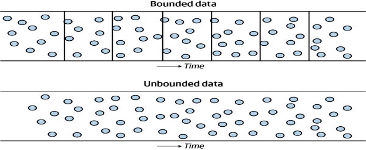

Ingestion

  

**Qu'est-ce que l'ingestion de données ?**

  

*L'ingestion de données* estle processus de déplacement des données d'un endroit à un autre.

Cela vaut la peine de comparer rapidement l'ingestion de données avecintégration de données.

- *l'ingestion* de données est un mouvement de données d'un point A à un point B.
- *l'intégration* de données combine des données provenant de sources disparates dans un nouvel ensemble de données.

**Considérations techniques clés pour la phase d'ingestion**

**Données limitées versus données illimitées**

  

- *Les données illimitées* sont des données telles qu'elles existent dans la réalité, au fur et à mesure que des événements se produisent, sporadiquement ou continuellement, en cours et en continu.
- *Les données délimitées* sont un moyen pratique de répartir les données sur une sorte de limite, telle que le temps.

**La fréquence**

  

Les fréquences d'ingestion varient considérablement de lentes à rapides, une entreprise peut envoyer ses données fiscales à un cabinet comptable une fois par an, un système peut ingérer en continu des événements provenant de capteurs IoT et les traiter en quelques secondes.

On parle de temps réel, mais dans la réalité, on est plus sûr du presque temps-réel (near real-time) car on inclut le transport et les transformations s'il y en a.

**Ingestion synchrone ou asynchrone**

  

Avec *ingestion synchrone* , la source, l'ingestion et la destination ont des dépendances complexes et sont étroitement couplées. Chaque étape du cycle de vie de l'ingénierie des données comporte des processus A, B et C dépendant directement les uns des autres, si le processus A échoue, les processus B et C ne peuvent pas démarrer ; si le processus B échoue, le processus C ne démarre pas

  

Avec *l'ingestion asynchrone* , les dépendances peuvent désormais fonctionner au niveau des événements individuels, comme elles le feraient dans un backend logiciel construit à partir de microservices. Les événements individuels deviennent disponibles dans le stockage dès qu'ils sont ingérés individuellement.

**Sérialisation et désérialisation**

En mouvementles données de la source à la destination impliquent la sérialisation et la désérialisation. Pour rappel, la *sérialisation* consiste à encoder les données d'une source et à préparer les structures de données pour les étapes de transmission et de stockage intermédiaire.

**Scalabilité**

  

En théorie, votre ingestion ne devrait jamais être un goulot d'étranglement. En pratique, les goulots d'étranglement d'ingestion sont assez courants. Le débit de données et la scalabilité du système deviennent critiques à mesure que vos volumes de données augmentent et que les exigences changent. Concevez vos systèmes pour qu'ils évoluent et se réduisent afin de s'adapter de manière flexible au débit de données souhaité.

**Fiabilité et durabilité**

Fiabilité et durabilité sont essentiels dans les étapes d'ingestion des pipelines de données. *La fiabilité* implique une disponibilité élevée et un basculement approprié pour les systèmes d'ingestion. *La durabilité* implique de s'assurer que les données ne sont pas perdues ou corrompues.

**Payload**

Un payload est l'ensemble de données que vous ingérez et possède des caractéristiques telles que le type, la forme, la taille, le schéma et les types de données, et les métadonnées.

**Type**

Les données ont un type : tabulaire, image, vidéo, texte, etc. Le type influence directement le format des données ou la manière dont elles sont exprimées en octets, noms et extensions de fichier. Par exemple, un type de données tabulaires peut être dans des formats tels que CSV ou Parquet, chacun de ces formats ayant des modèles d'octets différents pour la sérialisation et la désérialisation. Un autre type de données est une image, qui a un format JPG ou PNG et est intrinsèquement non structurée.

**Shape**

La forme des données est essentielle tout au long du cycle de vie de l'ingénierie des données. Par exemple, les dimensions pixel et rouge, vert, bleu (RVB) d'une image sont nécessaires pour former des modèles d'apprentissage en profondeur. Comme autre exemple, si vous essayez d'importer un fichier CSV dans une table de base de données et que votre CSV a plus de colonnes que la table de base de données, vous obtiendrez probablement une erreur lors du processus d'importation.

- *Tabulaire*

Le nombre de lignes et de colonnes dans l'ensemble de données, généralement exprimé en *M* lignes et *N* colonnes

- *JSON*

Les paires clé-valeur et la profondeur d'imbrication se produisent avec des sous-éléments

- *Texte*

Nombre de mots, de caractères ou d'octets dans le corps du texte

- *Images*

La largeur, la hauteur et la profondeur de couleur RVB (par exemple, 8 bits par pixel)

- *Audio non compressé*

Nombre de canaux (par exemple, deux pour la stéréo), profondeur d'échantillonnage (par exemple, 16 bits par échantillon), fréquence d'échantillonnage (par exemple, 48 kHz) et durée (par exemple, 10 003 secondes)

**Size**

La *taille* des données décrit le nombre d'octets. Pour réduire la taille d'un payload, elle peut être compressée dans divers formats tels que ZIP et TAR

**Schema and data types**

un schéma décrit les champs et les types de données dans ces champs. D'autres données, telles que du texte non structuré, des images et de l'audio, n'auront pas de schéma ou de types de données explicites.

**Détecter et gérer les changements de schéma en amont et en aval**

- Ajout d'une nouvelle colonne
- Changer un type de colonne
- Création d'un nouveau tableau
- Renommer une colonne

Les modifications de schéma peuvent toujours interrompre les pipelines en aval de la préproduction et de l'ingestion. Les ingénieurs doivent toujours mettre en œuvre des stratégies pour répondre automatiquement aux changements et alerter sur les changements qui ne peuvent pas être pris en charge automatiquement.

**Métadonnées**

Les métadonnées sont des données sur les données. Les métadonnées peuvent être aussi critiques que les données elles-mêmes. Sans une description détaillée des données, elles peuvent être de peu de valeur.

**Push Versus Pull Versus Poll Patterns**

Une stratégie *push* implique qu'un système source envoie des données à une cible, tandis qu'une stratégie *pull* implique qu'une cible lit les données directement à partir d'une source. Les frontières entre ces stratégies sont floues.

  

  

Une autre pattern consiste à demander à la source à partir de la destination s'il y eu un changement aux niveau des données, et uniquement pull les nouveaux changements s'il y en a.

  

**Considérations sur l'ingestion par batch**

L'ingestion par lots, qui implique le traitement de données en bloc, est souvent un moyen pratique d'ingérer des données. Cela signifie que les données sont ingérées en prenant un sous-ensemble de données d'un système source, en fonction d'un intervalle de temps ou de la taille des données accumulées

  

*L'ingestion de lots à intervalles de temps* est répandue dans les ETL commerciaux traditionnels pour l'entreposage de données. Ce modèle est généralement utilisé pour traiter les données une fois par jour, pendant la nuit, en dehors des heures de travail, pour fournir des rapports quotidiens, mais d'autres fréquences peuvent également être utilisées.

  

*L'ingestion de lots basée sur la taille* est assez courante lorsque les données sont déplacées d'un système basé sur le streaming vers un stockage d'objets ; en fin de compte, vous devez découper les données en blocs discrets pour un traitement futur dans un lac de données. Certains systèmes d'ingestion basés sur la taille peuvent diviser les données en objets en fonction de divers critères, tels que la taille en octets du nombre total d'événements.

**Snapshot ou extraction différentielle**

Ingénieurs de données doivent choisir de capturer des snapshot (instantanés complets) d'un système source ou différentiel

- *Instantanés complets*

Les ingénieurs saisissent l'état actuel complet du système sourcent à chaque lecture de mise à jour.

- Mise à *jour différentielle*

Les ingénieurs ne peuvent extraire que les mises à jour et les modifications depuis la dernière lecture du système source.

Alors que les mises à jour différentielles sont idéales pour minimiser le trafic réseau et l'utilisation du stockage cible, les lectures complètes d'instantanés restent extrêmement courantes en raison de leur simplicité.

**Exportation et ingestion basées sur des fichiers**

  

Les données sont assez souvent déplacées entre les bases de données et les systèmes à l'aide de fichiers. Les données sont sérialisées dans des fichiers dans un format échangeable, et ces fichiers sont fournis à un système d'ingestion.

Avec l'ingestion basée sur les fichiers, les processus d'exportation sont exécutés du côté de la source de données, ce qui donne aux ingénieurs du système source un contrôle total sur les données exportées et sur la manière dont les données sont prétraitées.

**ETL vs ELT

  

**

**Migration de données**

La migration de données est le processus de transférer toutes les données d'une source à une autre, généralement d'une base de données ou d'un système de stockage à un autre. Les avantages de la migration de données comprennent :

- La mise à niveau des systèmes existants pour prendre en charge de nouvelles fonctionnalités ou des performances améliorées.
- La consolidation de plusieurs sources de données en une seule pour une gestion plus efficace des données.
- La possibilité de récupérer des données en cas de panne ou de perte de données.
- Les inconvénients de la migration de données incluent :
- Les coûts élevés de la mise en place et de la maintenance de la migration de données.
- La complexité de la migration de grandes quantités de données.
- Les risques de perte de données ou de corruption de données lors du transfert.
- Temps d'arrêt possible des systèmes pour faire la migration.
- La nécessité de vérifier et de tester la qualité des données migrées.

Les migrations de données ne sont probablement pas courantes en tant qu'ingénieur de données, mais vous devez les connaître.

**Considérations sur l'ingestion de messages et de streaming**

**Évolution du schéma**

  

Évolution du schéma est courant lors de la gestion des données d'événement ; des champs peuvent être ajoutés ou supprimés, ou des types de valeur peuvent changer (par exemple, une chaîne en un entier).

- Si votre infrastructure de traitement d'événements dispose d'un registre de schéma, utilisez-le pour versionner vos modifications de schéma.
- Une file d'attente de lettres mortes peut vous aider à enquêter sur les problèmes liés aux événements qui ne sont pas correctement gérés
- Communiquer régulièrement avec les parties prenantes en amont sur les changements de schéma potentiels et à traiter de manière proactive les changements de schéma avec les équipes introduisant ces changements au lieu de réagir au destinataire des changements avec rupture

**Données tardives**

Un groupe d'événements peut se produire à peu près au même moment (heures d'événements similaires), mais certains peuvent arriver plus tard que d'autres (heures d'ingestion tardives) en raison de diverses circonstance

Pour gérer les données tardives, vous devez définir une heure limite à laquelle les données tardives ne seront plus traitées.

**Replay**

*Le replay* permet aux lecteurs de demander une série de messages de l'historique, ce qui vous permet de revenir en arrière dans l'historique de vos événements jusqu'à un point particulier dans le temps.

Vous devez réingérer et retraiter des données pour une plage de temps spécifique.

Par exemple :

- RabbitMQ supprime généralement les messages une fois que tous les abonnés les ont consommés.
- Kafka, Kinesis et Pub/Sub prennent tous en charge la conservation et la relecture des événements.

**Time to Live (TTL)**

Combien de temps conserverez-vous votre dossier d'événement ? Le TTL est généralement une configuration que vous définissez pendant combien de temps vous voulez que les événements vivent avant qu'ils ne soient reconnus et ingérés. Tout événement non reconnu qui n'est pas ingéré après l'expiration de sa durée de vie disparaît automatiquement.

Trouvez le bon équilibre d'impact TTL sur notre pipeline de données.

Un TTL extrêmement court (millisecondes ou secondes) peut entraîner la disparition de la plupart des messages avant le traitement.

Une durée de vie très longue (plusieurs semaines ou mois) créera un arriéré de nombreux messages non traités, ce qui entraînera de longs temps d'attente

**Taille des messages**

Vous devez vous assurer que le framework de streaming en question peut gérer la taille de message maximale attendue.

Exemple :

- Amazon Kinesis prend en charge une taille de message maximale de 1 Mo
- Kafka utilise par défaut cette taille maximale mais peut être configuré pour un maximum de 20 Mo ou plus

**Gestion des erreurs et files d'attente de lettres mortes**

  

Les événements qui ne peuvent pas être ingérés doivent être redirigés et stockés dans un emplacement distinct appelé *file d'attente de lettres mortes*

Une file d'attente de lettres mortes sépare les événements problématiques des événements pouvant être acceptés par le consommateur. Si les événements ne sont pas redirigés vers une file d'attente de lettres mortes, ces événements erronés risquent d'empêcher l'ingestion d'autres messages

**Location**

Il est souvent souhaitable d'intégrer le streaming sur plusieurs sites pour une redondance améliorée et de consommer les données à proximité de l'endroit où elles sont générées. En règle générale, plus votre ingestion est proche de l'origine des données, meilleures sont votre bande passante et votre latence.

**Façons d'ingérer des données**

**Connexion directe à la base de données**

  

Données peuvent être extraites de bases de données pour ingestion en interrogeant et en lisant via une connexion réseau. Le plus souvent, cette connexion est établie à l'aide d'ODBC ou de JDBC

JDBC (Java Database Connectivity) est un standard de programmation pour l'accès à des bases de données relationnelles à partir de programmes Java. Il fournit une interface pour envoyer des commandes SQL à une base de données et traiter les résultats obtenus.

- Il est intégré à Java, ce qui facilite son utilisation avec d'autres composants Java.
- Il est un standard de l'industrie, ce qui signifie qu'il est compatible avec de nombreux systèmes de gestion de bases de données différents.
- Il offre une grande flexibilité pour travailler avec des bases de données relationnelles.
- Il peut être complexe à utiliser pour des opérations de base de données avancées.
- Il peut être plus lent que d'autres technologies d'accès à des bases de données spécifiques à un système de gestion de bases de données.
- Il peut être nécessaire de charger des pilotes JDBC supplémentaires pour utiliser certaines bases de données.
- La JVM est une machine virtuelle de compilation extrêmement populaire pour exécuter du code de manière portable
- La machine virtuelle Java (JVM) est standard, portable sur les architectures matérielles et les systèmes d'exploitation, et fournit les performances du code compilé via un compilateur juste-à-temps (JIT).
- Ces normes de connexion ont du mal avec les données imbriquées et envoient les données sous forme de lignes

ODBC (Open Database Connectivity) est un standard de programmation pour l'accès à des bases de données relationnelles à partir de programmes Windows. Il fournit une interface pour envoyer des commandes SQL à une base de données et traiter les résultats obtenus.

- Il est un standard de l'industrie, ce qui signifie qu'il est compatible avec de nombreux systèmes de gestion de bases de données différents.
- Il permet l'accès à des bases de données depuis différents systèmes d'exploitation.
- Il offre une grande flexibilité pour travailler avec des bases de données relationnelles.
- Il est spécifique à Windows, il n'est pas disponible pour d'autres plateformes
- Il peut être complexe à utiliser pour des opérations de base de données avancées.
- Il peut être plus lent que d'autres technologies d'accès à des bases de données spécifiques à un système de gestion de bases de données.
- Il peut être nécessaire de charger des pilotes ODBC supplémentaires pour utiliser certaines bases de données.
- Ces normes de connexion ont du mal avec les données imbriquées et envoient les données sous forme de lignes

JDBC est conceptuellement remarquablement similaire à ODBC. De nombreuses bases de données prennent désormais en charge l'exportation de fichiers natifs qui contourne JDBC/ODBC et exporte les données directement dans des formats tels que Parquet, ORC et Avro. Alternativement, de nombreux entrepôts de données cloud fournissent des API REST directes.

**Change Data Capture**

**CDC orienté batch**

Si la table de base de données en question a un champ contenant la dernière fois qu'un enregistrement a été écrit ou mis à jour, nous pouvons interroger la table pour trouver toutes les lignes mises à jour depuis une heure spécifiée. Ce processus nous permet d'extraire les modifications et de mettre à jour de manière différentielle une table cible.

**CDC continu**

Plutôt que d'exécuter des requêtes périodiques pour obtenir un lot de modifications de table, le CDC continu traite chaque écriture dans la base de données comme un événement.

Le journal binaire de la base de données enregistre chaque modification de la base de données de manière séquentielle. Un outil CDC peut lire ce journal et envoyer les événements à une cible, telle que la plateforme de streaming Apache Kafka.

**Apis**

  

Il n'existe aucune norme appropriée pour l'échange de données via les API. Les ingénieurs de données peuvent passer beaucoup de temps à lire la documentation, à communiquer avec les propriétaires de données externes et à écrire et maintenir le code de connexion API, trois tendances modifient lentement cette situation.

- De nombreux fournisseurs fournissent des bibliothèques clientes d'API pour divers langages de programmation qui suppriment une grande partie de la complexité de l'accès aux API
- De nombreuses plates-formes de connecteurs de données sont désormais disponibles en tant que SaaS, open source ou open source gérée. Ces plates-formes fournissent une connectivité de données clé en main à de nombreuses sources de données ;
- L'émergence du partage de données, c'est-à-dire la possibilité d'échanger des données via une plate-forme standard telle que BigQuery, Snowflake, Redshift ou S3.

**Message Queues and Event-Streaming Platforms**

  

Un *message est* géré au niveau de l'événement individuel et est censé être transitoire. Une fois qu'un message est consommé, il est reconnu et supprimé de la file d'attente.

un *stream* ingère des événements dans un journal ordonné. Le journal persiste aussi longtemps que vous le souhaitez, ce qui permet d'interroger les événements sur différentes plages, de les agréger et de les combiner avec d'autres flux pour créer de nouvelles transformations publiées pour les consommateurs en aval.

Une autre considération est le débit de vos pipelines de données en temps réel. Les messages et les événements doivent circuler avec le moins de latence possible, ce qui signifie que vous devez provisionner une bande passante et un débit de partition (ou de partition) adéquats.

- Fournir suffisamment de ressources de mémoire, de disque et de processeur pour le traitement des événements
- Intégrez la mise à l'échelle automatique pour gérer les pics et économiser de l'argent à mesure que la charge diminue

**Connecteurs de données gérés**

  

Ces outils visent à fournir un ensemble standard de connecteurs prêts à l'emploi pour épargner aux ingénieurs de données la construction d'une plomberie compliquée à connecter à une source particulière.

Le fournisseur ou le cloud en coulisse gère et surveille entièrement les synchronisations de données. Si la synchronisation des données échoue, vous recevrez une alerte avec des informations consignées sur la cause de l'erreur.

Les fournisseurs et les projets OSS ont chacun généralement des centaines d'options de connecteurs prédéfinis et peuvent facilement créer des connecteurs personnalisés.

**Déplacer des données avec le stockage d'objets**

  

Stockage d'objets est un système mutualisé dans des clouds publics, et il prend en charge le stockage d'énormes quantités de données. Cela rend le stockage d'objets idéal pour déplacer des données dans et hors des data lakes entre équipes et transférer des données entre organisations. Vous pouvez même fournir un accès à court terme à un objet avec une URL signée, donnant à un utilisateur une autorisation temporaire.

**EDI (electronic data interchange)**

Généralement des moyens quelque peu archaïques d'échange de fichiers, tels que par

  

 courrier électronique ou par clé USB. Les ingénieurs de données constateront que certaines sources de données ne prennent pas en charge les moyens de transport de données plus modernes, souvent en raison de systèmes informatiques archaïques ou de limitations des processus humains.

Les ingénieurs peuvent au moins améliorer l'EDI grâce à l'automatisation.

**Bases de données et exportation de fichiers**

Les ingénieurs doivent savoir comment les systèmes de base de données source gèrent l'exportation de fichiers. L'exportation implique des analyses de données volumineuses qui chargent considérablement la base de données pour de nombreux systèmes transactionnels.

Les requêtes d'exportation peuvent être divisées en exportations plus petites en interrogeant sur des plages de clés ou une partition à la fois. Alternativement, un réplica en lecture peut réduire la charge. Les réplicas en lecture sont particulièrement appropriés si les exportations se produisent plusieurs fois par jour et coïncident avec une charge élevée du système source.

Les principaux entrepôts de données cloud sont hautement optimisés pour l'exportation directe de fichiers. Par exemple, Snowflake, BigQuery, Redshift et d'autres prennent en charge l'exportation directe vers le stockage d'objets dans divers formats.

**Problèmes pratiques avec les formats de fichiers courants**

  

Les ingénieurs doivent également connaître les formats de fichiers à exporter.

CSV est encore omniprésent et très sujet aux erreurs au moment d'écrire ces lignes. À savoir, le délimiteur par défaut de CSV est également l'un des caractères les plus familiers de la langue anglaise : la virgule ! Mais ça empire. .

CSV n'encode pas non plus nativement les informations de schéma ou ne prend pas directement en charge les structures imbriquées. L'encodage du fichier CSV et les informations de schéma doivent être configurés dans le système cible pour garantir une ingestion appropriée. La détection automatique est une fonctionnalité pratique fournie dans de nombreux environnements cloud, mais elle est inappropriée pour l'ingestion de production. Comme bonne pratique, les ingénieurs doivent enregistrer l'encodage CSV et les détails du schéma dans les métadonnées du fichier.

Les formats d'exportation plus robustes et expressifs incluent Parquet, Avro, Arrow et ORC ou JSON. Ces formats encodent nativement les informations de schéma et gèrent des données de chaîne arbitraires sans intervention particulière. Beaucoup d'entre eux gèrent également les structures de données imbriquées de manière native afin que les champs JSON soient stockés à l'aide de structures imbriquées internes plutôt que de simples chaînes.

**SSH**

  

SSH (Secure Shell) est un protocole de réseau qui permet de se connecter à un ordinateur distant et de lancer des commandes à distance. Il utilise une connexion cryptée pour assurer la sécurité de la communication entre les deux ordinateurs. Il est souvent utilisé pour accéder à des serveurs à distance, configurer des réseaux, transférer des fichiers, etc. Il peut également être utilisé pour créer des tunnels réseau sécurisés pour protéger les données sensibles.

- SSH peut être utilisé pour le transfert de fichiers avec SCP
- les tunnels SSH sont utilisés pour permettre des connexions sécurisées et isolées aux bases de données

**SFTP et SCP**

  

SFTP et SCP sont tous les deux des protocoles de transfert de fichiers qui reposent sur SSH pour assurer la sécurité de la communication. Cependant, ils ont des fonctionnalités et des utilisations légèrement différentes :

- SFTP (Secure File Transfer Protocol) est un protocole de transfert de fichiers qui permet de transférer des fichiers de manière sécurisée entre des ordinateurs distants, en utilisant des mécanismes de chiffrement pour protéger les données. Il permet également de naviguer dans les répertoires distants, de créer, supprimer, renommer des répertoires et des fichiers. Il est souvent utilisé pour transférer des fichiers vers et à partir de serveurs distants.
- SCP (Secure Copy Protocol) est un protocole de transfert de fichiers qui permet de copier des fichiers de manière sécurisée entre des ordinateurs distants, en utilisant des mécanismes de chiffrement pour protéger les données. Il ne permet pas de naviguer dans les répertoires distants, ni de créer, supprimer, renommer des répertoires et des fichiers. Il est souvent utilisé pour copier des fichiers vers et à partir de serveurs distants.

**Webhooks**

  

Comme vu précédemment, les webhooks contrairement à l'api envoie les données automatiquement quand un événement se produit.

  

**Transfer Appliances for Data Migration**

  

Pourdes quantités massives de données (100 To ou plus), le transfert de données directement sur Internet peut être un processus lent et coûteux. À cette échelle, le moyen le plus rapide et le plus efficace de déplacer des données n'est pas par câble, mais par camion. Les fournisseurs de cloud offrent la possibilité d'envoyer vos données via une "boîte de disques durs" physique. Commandez simplement un périphérique de stockage, appelé dispositif de *transfert* , chargez vos données à partir de vos serveurs, puis renvoyez-les au fournisseur de cloud, qui téléchargera vos données.
