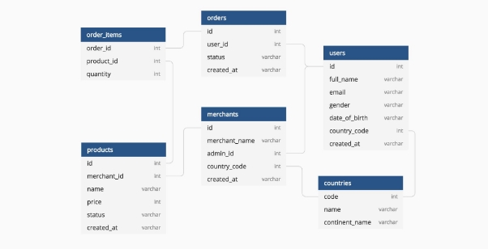
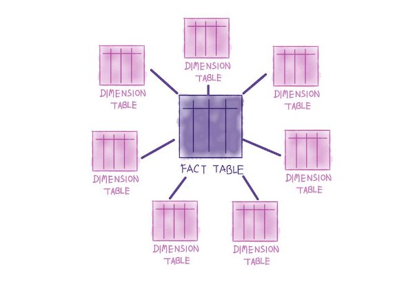
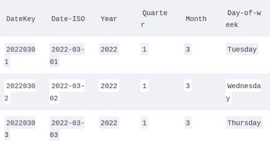
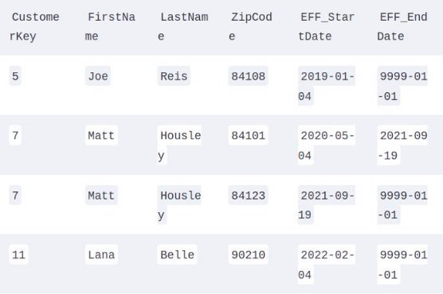
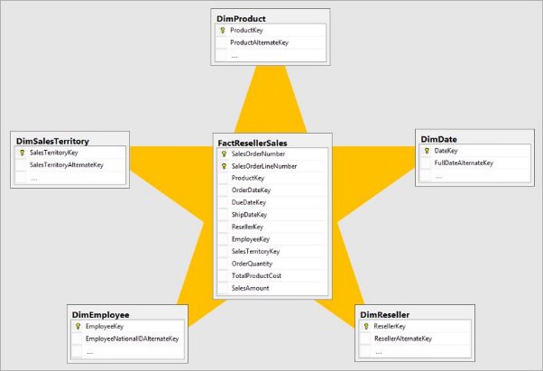
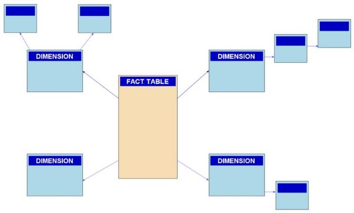
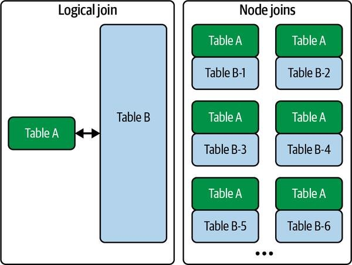
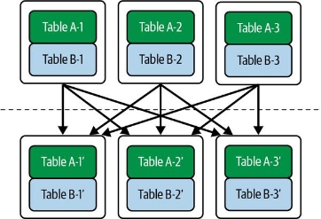
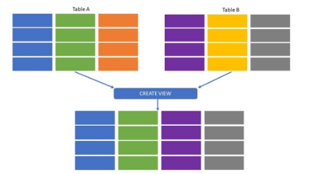
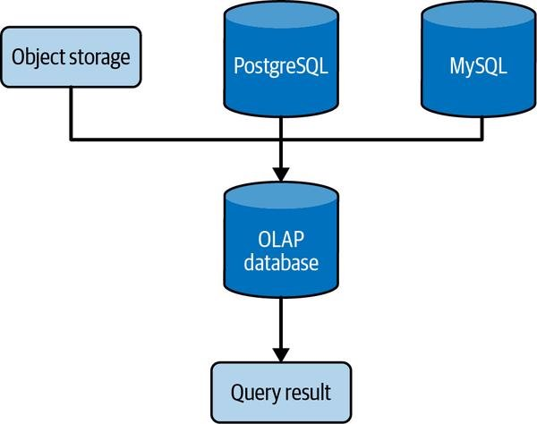

Requêtes, modélisation et transformation

**Requêtes**

Une requête vous permet de récupérer et d'agir sur des données.

Il est comparable au CRUD de la manière suivante :

**Data definition language (DDL)**

À un niveau élevé, vous devez d'abord créer les objets de la base de données avant d'ajouter des données. Vous utiliserez *commandes DDL.*

Les ingénieurs de données utilisent des expressions SQL DDL courantes :CREATE,DROP etUPDATE.

**Data manipulation language (DML)**

Après avoir utilisé DDL pour définir des objets de base de données, vous devez ajouter et modifier des données dans ces objets, vous devrez utiliser les commandes DML.

**Data control language (DCL)**

*Data control language* (DCL) vous permet de contrôler l'accès aux objets de la base de données ou aux données à l'aide de commandes SQL telles queGRANT,DENY etREVOKE

par exemple :

on donne le droit à Sarah d’accéder à la BDD data\_science\_db en lecture seul

Ici, on révoque ce même droit de lecture **Transaction control language**

Avec TCL, nous pouvons définir des points de contrôle de validation, des conditions d'annulation des actions, etc. Deux commandes TCL courantes incluentCOMMITet ROLLBACK.

**La vie d'une requête**

- Le moteur de base de données compile le SQL, analyse le code pour vérifier la sémantique appropriée et s'assure que les objets de base de données référencés existent et que l'utilisateur actuel dispose de l'accès approprié à ces objets.
- Le code SQL est converti en bytecode. Ce bytecode exprime les étapes qui doivent être exécutées sur le moteur de base de données dans un format efficace et lisible par machine.
- L'optimiseur de requête de la base de données analyse le bytecode pour déterminer comment exécuter la requête, réorganiser et refactoriser les étapes pour utiliser les ressources disponibles aussi efficacement que possible.
- La requête est exécutée et les résultats sont produits.

**L'optimiseur de requête**

Les requêtes peuvent avoir des temps d'exécution très différents, selon la façon dont ils sont exécutés. Le travail d'un optimiseur de requêtes consiste à optimiser les performances des requêtes et à minimiser les coûts en divisant la requête en étapes appropriées dans un ordre efficace.

**Amélioration des performances des requêtes**

**Optimisez votre stratégie et votre schéma de jointure**

Un ensemble de données unique (comme une table ou un fichier) est rarement utile en soi ; nous créons de la valeur en la combinant avec d'autres ensembles de données. *Les jointures* sont l'un des moyens les plus courants de combiner des ensembles de données et d'en créer de nouveaux.

- Si vous constatez que les requêtes d'analyse joignent les mêmes données à plusieurs reprises, il est souvent judicieux de joindre les données à l'avance et de lire les requêtes à partir de la version pré-jointe des données afin de ne pas répéter un travail de calcul intensif.
- Conserver un schéma plus normalisé, mais à pré-joindre des tables pour les cas d'utilisation les plus courants en matière d'analyse et de science des données. Nous pouvons simplement créer des tables pré-jointes et former les utilisateurs à les utiliser ou à se joindre à l'intérieur de vues matérialisées
- Tenez compte des détails et de la complexité de vos conditions de jointure. La logique de jointure complexe peut consommer des ressources de calcul importantes
- Utilisez-les common table expressions (CTEs) au lieu desous-requêtes ou tables temporaires imbriquées. Les CTE permettent aux utilisateurs de composer ensemble des requêtes complexes de manière lisible, ce qui vous aide à comprendre le stream de votre requête. L'importance de la lisibilité pour les requêtes complexes ne peut être sous-estimée.

**Utilisez le plan d'explication et comprenez les performances de votre requête**

Le plan d'explication de l'optimiseur de requête vous montrera comment l'optimiseur de requête a déterminé sa requête optimale la moins coûteuse, les objets de base de données utilisés (tables, index, cache, etc.) et diverses statistiques de consommation de ressources et de performances à chaque étape de la requête.

- Utilisation des ressources clés telles que le disque, la mémoire et le réseau.
- Temps de chargement des données versus temps de traitement.
- Le temps d'exécution de la requête, le nombre d'enregistrements, la taille des données analysées et la quantité de données mélangées.
- Requêtes concurrentes susceptibles de provoquer des conflits de ressources dans votre base de données.
- Nombre de connexions simultanées utilisées par rapport aux connexions disponibles. Les connexions simultanées sursouscrites peuvent avoir des effets négatifs sur vos utilisateurs qui peuvent ne pas être en mesure de se connecter à la base de données.

**Éviter les analyses de table complètes**

- En règle générale, vous ne devez interroger que les données dont vous avez besoin. Lorsque vous exécutezSELECT \*sans prédicats, vous parcourez l'intégralité de la table et récupérez chaque ligne et chaque colonne. Ceci est très inefficace en termes de performances et coûteux, en particulier si vous utilisez une base de données payante qui vous facture soit pour les octets analysés, soit pour les ressources de calcul utilisées pendant l'exécution d'une requête.
- Dans une base de données orientée colonnes, vous devez sélectionner uniquement les colonnes dont vous avez besoin.

**Tirer parti des résultats de requête mis en cache**

- Au lieu de réexécuter la même requête sur la base de données à plusieurs reprises et d'encourir des frais énormes, ne serait-il pas agréable que les résultats de la requête soient stockés et disponibles pour une récupération instantanée ? De nombreuses bases de données cloud OLAP mettent en cache les résultats des requêtes.

**Requêtes sur les données en continu**

**L'approche du suiveur rapide**

Le modèle de requête CDC de base nous permet de fournir des analyses en temps réel avec un impact minimal sur le système de production. Le modèle suiveur rapide peut utiliser une base de données transactionnelle conventionnelle comme suiveur, mais l'utilisation d'un système orienté OLAP approprié présente des avantages significatifs.

**L'architecture Kappa**

Lorsque les bases de données d'application de production sont la source, l'architecture Kappa stocke les événements du CDC. Au lieu de simplement traiter un système de stockage en continu comme un tampon, l'architecture Kappa conserve les événements dans le stockage pendant une période de rétention plus longue, et les données peuvent être directement interrogées à partir de ce stockage. La période de conservation peut être assez longue (mois ou années). Notez que c'est beaucoup plus long que la période de rétention utilisée dans les systèmes orientés purement temps réel, généralement une semaine au maximum.

**Windows, triggers, statistiques émises et données tardives Session window**

*La fenêtre de session* regroupe les événements qui se produisent à proximité les uns des autres et filtre les périodes d'inactivité lorsque aucun événement ne se produit. Nous pourrions dire qu'une session utilisateur correspond à n'importe quel intervalle de temps sans intervalle d'inactivité de cinq minutes ou plus. Notre système collecte des données par une clé d'identification d'utilisateur, ordonne des événements, détermine les lacunes et les limites de session, et calcule des statistiques pour chaque session.

**Fixed-time windows**

*La fenêtre à temps fixe* comporte des périodes de temps fixes qui s'exécutent selon un calendrier fixe et traite toutes les données depuis la fermeture de la fenêtre précédente.

**Sliding windows**

Les événements dans une fenêtre glissante sont regroupées en fenêtres de durée fixe, où des fenêtres distinctes peuvent se chevaucher. Tout comme nous le faisions auparavant, nous pouvons émettre des statistiques moyennes et médianes.

**Watermarks**

Un watermark est un seuil utilisé par une fenêtre pour déterminer si les données d'une fenêtre se situent dans l'intervalle de temps établi ou si elles sont considérées comme en retard. Si des données arrivent qui sont nouvelles dans la fenêtre, mais plus anciennes que l'horodatage du watermark, elles sont considérées comme des données tardives.

**Combiner des stream avec d'autres données Jointures de tables conventionnelles**

Les tables peuvent être alimentées par des stream. L'approche la plus élémentaire de ce problème consiste simplement à joindre ces deux tables dans une base de données. Un stream peut alimenter l'une de ces tables ou les deux.

**Enrichissement**

*L'enrichissement* signifie que nous joignons un stream à d'autres données. En règle générale, cela est fait pour fournir des données améliorées dans un autre stream.

**Rejoindre flux à flux**

Les architectures de jointure en continu typiques reposent sur des mémoire tampons. L'intervalle de rétention de la mémoire tampon est configurable ; un intervalle de conservation plus long nécessite plus de stockage et d'autres ressources. Les événements sont joints aux données dans la mémoire tampon et sont finalement supprimés une fois l'intervalle de rétention écoulé

**La modélisation des données**

La modélisation des données implique de choisir délibérément une structure cohérente pour les données et constitue une étape critique pour rendre les données utiles à l'entreprise.

**Qu'est-ce qu'un modèle de données ?**

Un *modèle de données* représente la façon dont les données se rapportent au monde réel. Il reflète la manière dont les données doivent être structurées et standardisées pour refléter au mieux les processus, les définitions, les workflows et la logique de votre organisation. Un bon modèle de données capture la façon dont la communication et le travail se déroulent naturellement au sein de votre organisation.

**Modèles de données conceptuels, logiques et physiques**

- *Conceptuel :*
  - *Contient la logique et les règles métier et décrit les données du système, telles que les schémas, les tables et les champs (noms et types). Lors de la création d'un modèle conceptuel, il est souvent utile de le visualiser dans un diagramme entité-relation (ER), qui est un outil standard pour visualiser les relations entre diverses entités dans vos données (commandes, clients, produits, etc.).*
- *Logique*
  - *Les détails de comment le modèle conceptuel sera mis en œuvre dans la pratique en ajoutant beaucoup plus de détails. Par exemple, nous ajouterions des informations sur les types d'ID client, les noms des clients et les adresses personnalisées. De plus, nous mapperions les clés primaires et étrangères.*
- *Physique*
  - *Définit comment le modèle logique sera implémenté dans un système de base de données. Nous ajouterions des bases de données, des schémas et des tables spécifiques à notre modèle logique, y compris les détails de configuration.*

En général, vous devez vous efforcer de modéliser vos données au niveau de grain le plus bas possible. À partir de là, il est facile d'agréger cet ensemble de données très granulaire. L'inverse n'est pas vrai et il est généralement impossible de restaurer les détails qui ont été agrégés.

**Normalisation**

*La normalisation* est une pratique de modélisation des données de base de données qui applique un contrôle strict sur les relations des tables et des colonnes au sein d'une base de données. Le but de la normalisation est de supprimer la redondance des données au sein d'une base de données et d'assurer l'intégrité référentielle. Fondamentalement, il *ne s'agit pas de vous répéter* (DRY) appliqué aux données d'une base de données.

- *Dénormalisé*

Non-normalisation. Les données imbriquées et redondantes sont autorisées.

- *Première forme normale (1NF)*

Chaque colonne est unique et a une valeur unique (au sens sémantique). La table a une clé primaire unique.

- *Deuxième forme normale (2NF)*

Les exigences de 1NF, plus les dépendances partielles, sont supprimées. Une dépendance fonctionnelle partielle signifie qu'une partie des données dans une table est utilisée pour déterminer les autres données dans la table. De plus, si la clé primaire est une clé composée, aucun élément de la clé primaire doit permettre d’identifier une colonne.

- *Troisième forme normale (3NF)*

Les exigences de 2NF, de plus chaque table ne contient que des champs pertinents liés à sa clé primaire et n'a pas de dépendances transitives.

La normalisation permet d’éviter des incohérence :

- anomalie d’insertion :
  - Dans le cadre d’une insertion de données dans la table dénormalisé, si elle contient des million de lignes et qu’une erreur venait à subvenir, la retrouver relève de l’impossible
- anomalie de suppression :
  - Si une ligne contient une information unique et qu’elle venait à être supprimée, cette information viendrait à être définitivement perdu
- anomalie de mise à jour :
  - Si une données de référence est contenue dans plusieurs ligne d’une de table (adresse, ville, pays, auteur) elle devra être mise à jour sur toutes les lignes

**Techniques de modélisation des données analytiques par lots**

**Inmon**

Quatre principes fondamentaux pour un data warehouse :

- *Axé sur le sujet*

L'entrepôt de données se concentre sur un domaine spécifique, tel que les ventes ou le marketing.

- *Intégré*

Les données provenant de sources disparates sont consolidées et normalisées.

- *Non volatile*

Les données restent inchangées après leur stockage dans un entrepôt de données.

- *Variable dans le temps*

Différentes plages de temps peuvent être interrogées.

**Kimball**

Le modèle Kimball est ascendant, vous encourageant à modéliser et à servir l'analyse du département ou de l'entreprise dans l'entrepôt de données lui-même. Cela peut permettre une itération et une modélisation plus rapides qu'Inmon, avec le compromis d'une intégration de données potentiellement plus lâche, de la redondance des données et de la duplication.

Vous pouvez penser à une table *de faits* comme une table de nombres, et *les tables de dimension* comme données qualitatives référençant un fait.

**Table de faits**

Le premier type de table dans un schéma en étoile est la table de faits, qui contient des données *factuelles* , quantitatives et liées à des événements. Les données d'une table de faits sont immuables, car les faits sont liés à des événements. Par conséquent, les tables de faits ne changent pas et sont ajoutées uniquement. Les tables de faits sont généralement étroites et longues, ce qui signifie qu'elles n'ont pas beaucoup de colonnes, mais beaucoup de lignes qui représentent des événements. Les tables de faits doivent être au grain le plus bas possible.

Exemple de table de fait :

**Table de dimensions**

Les tables de dimension fournissent les données de référence, les attributs et le contexte relationnel pour les événements stockés dans les tables de faits. Les tables de dimension sont plus petites que les tables de faits et prennent une forme opposée, généralement large et courte. Les dimensions sont dénormalisées, avec la possibilité de données en double. C'est OK dans le modèle de données Kimball.

Il existe plusieurs type de table de dimension :

- Type 1

Remplacer les enregistrements de dimension existants. C'est très simple et signifie que vous n'avez pas accès aux enregistrements de dimension historiques supprimés.

- Type 2

Conservez un historique complet des enregistrements de dimension. Lorsqu'un enregistrement change, cet enregistrement spécifique est marqué comme modifié et un nouvel enregistrement de dimension est créé, reflétant l'état actuel des attributs.

- Tapez 3

Un SCD (slowly changing dimension) de type 3 est similaire à un SCD de type 2, mais au lieu de créer une nouvelle ligne, une modification dans un SCD de type 3 crée un nouveau champ. En utilisant l'exemple précédent, voyons à quoi cela ressemble en tant que SCD de type 3 dans les tableaux suivants.

Exemple de table de dimension : Type 1 :

le Type 1 est le comportement par défaut de la plupart des entrepôts de données, et le Type 2 est celui que nous voyons le plus couramment utilisé dans la pratique

Type 2 :

Type 3 :

**Star schema**

Maintenant que vous avez une compréhension de base des faits et des dimensions, il est temps de les intégrer dans un schéma en étoile. Le *schéma en étoile* représente le modèle de données de l'entreprise. Contrairement aux approches hautement normalisées de la modélisation des données, le schéma en étoile est une table de faits entourée des dimensions nécessaires. Cela entraîne moins de jointures que les autres modèles de données, ce qui accélère les performances des requêtes. Un autre avantage d'un schéma en étoile est qu'il est sans doute plus facile à comprendre et à utiliser pour les utilisateurs professionnels.

- Facilité de compréhension pour les utilisateurs finaux
- Simplicité de la requête
- Performances améliorées par rapport à des modèles plus complexes
- Redondance de données peut causer des problèmes d'inconsistance
- Pas adapté pour des cas de données normalisées

**Snowflake schema**

Le Snowflake schema est un modèle de conception de bases de données qui utilise des tables de dimension normalisées pour réduire la redondance des données. Il est similaire au Star schema, mais les tables de dimension sont subdivisées en sous-tables pour réduire les redondances et les dépendances fonctionnelles inutiles. Le Snowflake schema est généralement utilisé dans les systèmes de Business Intelligence ou d'analyse de données pour faciliter les requêtes et les analyses tout en réduisant les problèmes d'inconsistance des données.

- Meilleure qualité de données, moins de redondance
- Meilleures performances pour les requêtes complexes
- Meilleure flexibilité pour les mises à jour de données
- Plus complexe à comprendre pour les utilisateurs finaux
- Requêtes plus complexes à écrire

**Tables larges dénormalisées**

*Une table large* est exactement ce à quoi elle ressemble : une collection hautement dénormalisée et très large de nombreux champs, généralement créée dans une base de données en colonnes.

Raison :

- La popularité du cloud signifie que le stockage est très bon marché.
- La popularité des données imbriquées (JSON et similaires) signifie que les schémas sont flexibles dans les systèmes sources et analytiques.
- Les requêtes analytiques sur des tables larges s'exécutent souvent plus rapidement que des requêtes équivalentes sur des données hautement normalisées nécessitant de nombreuses jointures.
- La suppression des jointures peut avoir un impact considérable sur les performances d'analyse.

**Transformations**

Une transformation diffère d'une requête. Une *requête* récupère les données de diverses sources en fonction du filtrage et de la logique de jointure. Une *transformation* conserve les résultats pour la consommation par des transformations ou des requêtes supplémentaires. Ces résultats peuvent être stockés de manière éphémère ou permanente.

Les transformations reposent essentiellement sur l'un des principaux courants sous-jacents de ce livre : l'orchestration. L'orchestration combine de nombreuses opérations discrètes, telles que des transformations intermédiaires, qui stockent des données de manière temporaire ou permanente pour être consommées par des transformations ou des services en aval. De plus en plus, les pipelines de transformation couvrent non seulement plusieurs tables et ensembles de données, mais également plusieurs systèmes.

**Transformations par lots**

*Les transformations par lots* sont exécutées sur des blocs de données discrets, contrairement aux transformations en continu, où les données sont traitées en continu à mesure qu'elles arrivent. Les transformations par lots peuvent s'exécuter selon un calendrier fixe (par exemple, quotidiennement, toutes les heures ou toutes les 15 minutes)

**Distributed joins**

L'idée de base derrière les jointures distribuées est que nous devons diviser une *jointure logique* (la jointure définie par la logique de requête) en *jointures de nœuds* beaucoup plus petites qui s'exécutent sur des serveurs individuels du cluster.

**Broadcast join**

Une *jointure de diffusion* est généralement asymétrique, avec une grande table répartie sur les nœuds et une petite table qui peut facilement tenir sur un seul nœud. Le moteur de requête "diffuse" la petite table (table A) à tous les nœuds, où elle est jointe aux parties de la grande table (table B). Les jointures de diffusion sont beaucoup moins gourmandes en calcul que les jointures de hachage aléatoires.

**Shuffle hash join**

Si aucune table n'est assez petite pour tenir sur un seul nœud, le moteur de requête utilisera une *jointure de hachage aléatoire* . Les mêmes nœuds sont représentés au-dessus et au-dessous de la ligne pointillée. La zone au-dessus de la ligne pointillée représente le partitionnement initial des tables A et B sur les nœuds.

Dans cet exemple, le schéma de hachage divisera la clé de jointure en trois parties, chaque partie étant affectée à un nœud. Les données sont ensuite réorganisées vers le nœud approprié et les nouvelles partitions des tables A et B sur chaque nœud sont jointes. Les jointures de hachage aléatoires sont généralement plus gourmandes en ressources que les jointures de diffusion.

**MapReduce**

MapReduce était le modèle de transformation de données par lots déterminant de l'ère du Big Data, il influence encore aujourd'hui de nombreux ingénieurs de données de systèmes distribués, et il est utile que les ingénieurs de données comprennent à un niveau de base.

La première étape, "map", permet de transformer les données en entrée en un ensemble de paires clé-valeur, tandis que la seconde étape, "reduce", permet d'agréger les données en sortie.

- Capacité à traiter des quantités importantes de données de manière efficace en utilisant des clusters de machines.
- Grande tolérance aux pannes, car les données sont réparties sur plusieurs machines.
- Simplicité de programmation, car le développeur n'a pas besoin de se soucier de la distribution des données sur les machines.
- Temps de latence élevé, car les données doivent être transférées entre les différentes machines.
- Difficulté à gérer les tâches de traitement qui ne peuvent pas être décomposées en étapes de map et reduce.
- Nécessité d'utiliser un système de fichiers distribué pour stocker les données, ce qui peut augmenter les coûts.

**Vues matérialisées, fédération et virtualisation des requêtes**

**Vues**

Une *vue* est un objet de base de données que nous pouvons sélectionner comme n'importe quelle autre table. En pratique, une vue n'est qu'une requête qui fait référence à d'autres tables.

- Les vues peuvent jouer un rôle de sécurité. Par exemple, les vues peuvent sélectionner uniquement des colonnes spécifiques et filtrer des lignes, offrant ainsi un accès restreint aux données.
- Une vue peut être utilisée pour fournir une image dédupliquée actuelle des données. Si nous utilisons un modèle d'insertion uniquement, une vue peut être utilisée pour renvoyer une version dédupliquée d'une table affichant uniquement la dernière version de chaque enregistrement.
- Les vues peuvent être utilisées pour présenter des modèles d'accès aux données courants. Supposons que les analystes marketing doivent fréquemment exécuter une requête qui joint cinq tables. Nous pourrions créer une vue qui réunit ces cinq tables en une table large. Les analystes peuvent ensuite rédiger des requêtes qui filtrent et agrègent au-dessus de cette vue.

**Vues matérialisées**

Les vues et les vues matérialisées sont similaires en ce qu'elles permettent aux utilisateurs de visualiser et d'interagir avec les données d'une base de données de manière simplifiée. Cependant, il existe des différences clés entre les deux :

- Stockage des données : Les vues sont simplement des sélections de données qui sont générées à chaque fois qu'elles sont utilisées. Les vues matérialisées, d'autre part, stockent physiquement les données sélectionnées dans une table distincte, ce qui permet un accès plus rapide aux données.
- Mise à jour des données : Les vues sont générées à partir des données des tables de base de données sous-jacentes, donc si les données de ces tables sont mises à jour, les vues seront également mises à jour. Les vues matérialisées, d'autre part, stockent les données de manière indépendante, donc elles ne sont pas automatiquement mises à jour si les données des tables de base de données sous-jacentes changent. Il faut donc les rafraîchir manuellement.
- Performance : Les vues peuvent avoir une performance inférieure aux vues matérialisées car les requêtes sur les vues doivent être traduites en requêtes sur les tables de base de données sous-jacentes. Les vues matérialisées, étant stockées physiquement, sont généralement plus rapides car les données sont déjà disponibles.
- Utilisation : Les vues sont souvent utilisées pour masquer les détails de la structure de la base de données sous-jacente, ce qui facilite la maintenance et la sécurité des données. Les vues matérialisées sont utilisées pour améliorer les performances des requêtes récurrentes sur des jeux de données volumineux.

**Requêtes fédérées**

*Les requêtes fédérées* sont une fonctionnalité de base de données qui permet à une base de données OLAP de sélectionner une source de données externe, telle qu'un stockage d'objets ou un SGBDR.

Caractéristiques :

- La possibilité d'accéder à des données stockées à des emplacements différents en utilisant une seule requête.
- La possibilité de combiner des données de différentes sources pour créer des rapports et des visualisations plus riches.
- La performance peut être réduite par rapport à des requêtes sur une seule source de données en raison de la complexité supplémentaire impliquée dans la combinaison de données à partir de différentes sources.
- Les erreurs peuvent survenir lors de l'interrogation de sources de données qui ne sont pas compatibles avec la requête.
- Il peut être difficile de maintenir la cohérence des données lorsque des données sont combinées à partir de différentes sources.
- Les vues et les vues matérialisées sont utilisées pour sélectionner des données à partir d'une seule source de données, tandis que les requêtes fédérées permettent d'interroger des données à partir de plusieurs sources de données.
- Les vues et les vues matérialisées sont généralement utilisées pour masquer les détails de la structure de la base de données sous-jacente, ce qui facilite la maintenance et la sécurité des données, tandis que les requêtes fédérées sont utilisées pour combiner des données de différentes sources pour créer des rapports et des visualisations plus riches.
