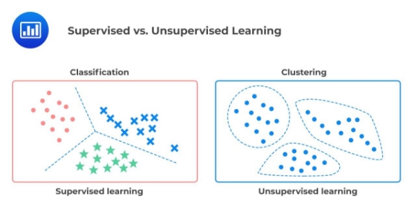
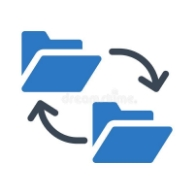

Servir des données pour l'analyse, l'apprentissage automatique et l'ETL inverse

  

## Considérations générales pour la diffusion de données

## Confiance

  

Les utilisateurs finaux doivent avoir confiance dans les données qu'ils reçoivent. Souvent, les parties prenantes perdent confiance dans les données. Une fois la confiance perdue, il est incroyablement difficile de la regagner. Cela conduit inévitablement l'entreprise à ne pas fonctionner au maximum de son potentiel, les données et les équipes de données perdant leur crédibilité (et pouvant être dissoutes).

Pour réaliser la qualité des données et renforcer la confiance des parties prenantes, utilisez des processus de validation et d'observabilité des données, en conjonction avec une inspection visuelle et une confirmation de la validité avec les parties prenantes.

- *La validation des données analyse* les données pour s'assurer qu'elles représentent avec précision les informations financières, les interactions avec les clients et les ventes.
- *L’observabilité des données fournit* une vue continue des données et des processus de données.

Il incombe aux ingénieurs de renforcer la confiance dans leurs SLA et SLO avec leurs utilisateurs finaux et les parties prenantes en amont.

  

Un contrat de niveau de service (SLA, pour Service Level Agreement) est un accord entre un fournisseur de services et un client qui définit les niveaux de service attendus pour un service particulier. Dans le contexte des données, un contrat SLA peut inclure des éléments tels que la disponibilité, la performance, la récupération après sinistre, la sécurité et la confidentialité des données.

- Il permet de définir clairement les attentes en matière de niveau de service pour les données, ce qui facilite la communication entre le fournisseur de services et le client.
- Il permet de garantir que les données seront disponibles et sécurisées selon les normes définies dans le contrat.
- Il permet de mesurer les performances des services de données et d'identifier les domaines où il est nécessaire d'apporter des améliorations.

Un contrat de niveau d'objectif (SLO, pour Service Level Objective) est un sous-ensemble d'un contrat de niveau de service (SLA) qui définit les objectifs de performance pour un service de données particulier. Il décrit les indicateurs de performance clés (KPIs, pour Key Performance Indicators) qui sont utilisés pour mesurer la qualité du service et les seuils de performance acceptables pour chaque indicateur.

Alors qu'un SLA est un document formel qui définit les niveaux de service attendus pour un service de données, un SLO est plus spécifique et se concentre sur les objectifs de performance pour un sous-ensemble particulier du service. Il peut inclure des éléments tels que la disponibilité, la latence, la vitesse de traitement, la récupération après sinistre, la sécurité et la confidentialité des données.

## Quel est le cas d'utilisation et qui est l'utilisateur ?

Lorsque vous démarrez un nouveau projet de données, il est utile de revenir en arrière. Bien qu'il soit tentant de se concentrer sur les outils, nous vous encourageons à commencer par le cas d'utilisation et les utilisateurs.

Voici quelques questions à vous poser avant de commencer :

- Qui utilisera les données et comment les utilisera-t-il ?
- Qu'attendent les parties prenantes ?
- Comment puis-je collaborer avec les parties prenantes des données (par exemple, les scientifiques des données, les analystes, les utilisateurs métier) pour comprendre comment les données avec lesquelles je travaille seront utilisées ?

## Produits de données

  

Lors de la création d'un produit de données, gardez ces considérations à l'esprit :

- Lorsqu'une personne utilise le produit de données, qu'espère-t-elle accomplir ? Trop souvent, les produits de données sont créés sans une compréhension claire du résultat attendu par l'utilisateur.
- Le produit de données servira-t-il des utilisateurs internes ou externes ? Lors de la création d'un produit de données, savoir si votre client est interne ou externe aura un impact sur la manière dont les données sont servies.
- Quels sont les résultats et le retour sur investissement du produit de données que vous créez ?

## Self-service ou non ?

Le self-service de données est une approche qui permet aux utilisateurs de gérer et d'exploiter les données par eux-mêmes, sans avoir à passer par un département informatique ou une équipe de données dédiée. Cela peut inclure des fonctionnalités telles que la découverte de données, l'analyse de données, la visualisation de données et la création de rapports.

- Il permet aux utilisateurs de gagner du temps en accédant aux données dont ils ont besoin rapidement et efficacement.
- Il peut améliorer la prise de décision en permettant aux utilisateurs de visualiser et d'analyser les données eux-mêmes.
- Il peut réduire les coûts en réduisant les dépendances envers les équipes de données et les départements informatiques.
- Il peut augmenter les risques de sécurité des données en permettant aux utilisateurs d'accéder à des données sensibles.
- Il peut entraîner des incohérences dans les données en permettant aux utilisateurs de les manipuler de manière indépendante.
- Il peut entraîner des problèmes de performance si les utilisateurs effectuent des requêtes inefficaces ou mal optimisées.

Les produits de données en libre-service, qui donnent à l'utilisateur la possibilité de créer lui-même des produits de données, sont une aspiration commune des utilisateurs de données depuis de nombreuses années. Quoi de mieux que de simplement donner à l'utilisateur final la possibilité de créer directement des rapports, des analyses et des modèles de ML ? Bien que nous voyions parfois des entreprises réussir le libre-service avec des données, cela est rare. La plupart du temps, les tentatives de données en libre-service commencent avec de grandes intentions, mais finissent par échouer ; les données en libre-service sont difficiles à mettre en œuvre dans la pratique.

## Définitions des données et logique

  

*Définition des données* fait référence à la signification des données telles qu'elles sont comprises dans l'ensemble de l'organisation.

*La logique des données* stipule les formules pour dériver des métriques à partir de données.

Les entreprises ont tendance à les transmettre de manière non formelle, mais il est mieux d’imposer un cadre structuré comme un data calog pour faciliter toutes les tâches qui pourraient décoller des données.

- Modélisation
- Analyse
- Machine learning

## Analytique

## Analytique commerciale

Consiste à l’utilisations *de l'analyse commerciale des* données historiques et actuelles pour prendre des décisions stratégiques et exploitables. Les types de décisions ont tendance à prendre en compte les tendances à plus long terme et impliquent souvent une combinaison d'analyses statistiques et de tendances, ainsi que l'expertise du domaine et le jugement humain. L'analyse d'entreprise est autant un art qu'une science.

- dashboard
- rapport
- Analyse ad hoc

Un dashboard montre de manière concise aux décideurs les KPI (Key of performance) d'une organisation par rapport à une poignée d'indicateurs de base, tels que les ventes et la fidélisation de la clientèle.

  

Les analystes sont souvent chargés par les parties prenantes de l'entreprise de créer un *rapport* L'objectif d'un rapport est d'utiliser les données pour générer des informations et des actions. La différence avec un dashboard est flou, mais si on devait la résumer, le rapport est en amont du dashboard et moins formel.

Les rapports commencent généralement par des demandes ad hoc. Si les résultats de l'analyse ad hoc ont un impact, ils se retrouvent souvent dans un rapport ou un tableau de bord

## Analytique opérationnelle

  

l'analytique opérationnelle utilise les données pour prendre *des mesures immédiates*

Analyse opérationnelle contre analyse commerciale ⇔ action immédiate contre informations exploitables

La grande différence entre l'analyse opérationnelle et l'analyse commerciale est le temps . Les données utilisées dans l'analyse commerciale adoptent une vision plus longue de la question à l'étude. Les mises à jour à la seconde sont bonnes à avoir, mais n'auront pas d'impact matériel sur la qualité ou le résultat. L'analyse opérationnelle est tout le contraire, car les mises à jour en temps réel peuvent avoir un impact sur la résolution d'un problème lorsqu'il se produit.

Exemple :

- La surveillance des applications en temps réel. De nombreuses équipes d'ingénierie logicielle souhaitent connaître les performances de leur application. Si des problèmes surviennent, ils veulent être informés immédiatement.

## Analytique intégrée

Alors que les analyses commerciales et opérationnelles sont axées sur l'interne, une tendance récente est l'analyse externe ou intégrée. Les entreprises fournissent de plus en plus d'analyses aux utilisateurs finaux.

Exemple :

- Un thermostat intelligent dispose d'une application mobile qui affiche la température en temps réel et des mesures de consommation d'énergie à jour, permettant à l'utilisateur de créer un meilleur programme de chauffage ou de refroidissement.
- Une plate-forme de commerce électronique tierce fournit à ses vendeurs un tableau de bord en temps réel sur les ventes, les stocks et les retours.

Considération :

- Les utilisateurs d'applications ne sont pas aussi tolérants que les analystes internes de l'entreprise vis-à-vis du traitement par lots peu fréquent.
- Les utilisateurs d'applications de données s'attendent à *performances des requêtes*
- Les applications de données doivent souvent prendre en charge des taux de requête extrêmement élevés sur de nombreux tableaux de bord et de nombreux clients. La haute concurrence est essentielle.

## Machine learning

**Ce qu'un ingénieur de données doit savoir sur le ML

  

**

  

- La différence entre l'apprentissage supervisé, non supervisé et semi-supervisé.
- La différence entre les techniques de classification et de régression.
- Les différentes techniques de traitement des données de séries chronologiques. Cela comprend l'analyse des séries chronologiques, ainsi que la prévision des séries chronologiques.
- Quand utiliser les techniques « classiques » (régression logistique, tree-based learning, support vector machines) versus deep learning. Nous voyons constamment les scientifiques des données passer immédiatement à l'apprentissage en profondeur lorsqu'il est exagéré. En tant qu'ingénieur de données, vos connaissances de base en ML peuvent vous aider à déterminer si une technique de ML est appropriée et à mettre à l'échelle les données que vous devrez fournir.
- Quand utiliseriez-vous l'apprentissage automatique automatisé (AutoML) par rapport à la fabrication manuelle d'un modèle ML ? Quels sont les compromis avec chaque approche concernant les données utilisées ?
- Quelles sont les techniques de data-wrangling utilisées pour les données structurées et non structurées ?
- Toutes les données utilisées pour le ML sont converties en nombres. Si vous diffusez des données structurées ou semi-structurées, assurez-vous que les données peuvent être correctement converties pendant le processus d'ingénierie des fonctionnalités.
- Comment encoder des données catégorielles et les intégrations pour différents types de données.
- La différence entre l'apprentissage par lots et en ligne. Quelle approche est appropriée pour votre cas d'utilisation ?
- Comment le cycle de vie de l'ingénierie des données se croise-t-il avec le cycle de vie du ML dans votre entreprise ? Serez-vous responsable de l'interface avec ou de la prise en charge des technologies ML telles que les magasins de fonctionnalités ou l'observabilité ML ?
- Sachez quand il est approprié de former localement, sur un cluster ou en périphérie. Quand utiliseriez-vous un GPU plutôt qu'un CPU ? Le type de matériel que vous utilisez dépend en grande partie du type de problème de ML que vous résolvez, de la technique que vous utilisez et de la taille de votre ensemble de données.
- Connaître la différence entre les applications de données par lots et de données en continu dans les modèles de ML de formation. Par exemple, les données par lots s'adaptent souvent bien à la formation de modèles hors ligne, tandis que les données en continu fonctionnent avec la formation en ligne.
- Que sont [les cascades de données](https://oreil.ly/FBV4g) et quel impact peuvent-elles avoir sur les modèles de ML ?
- Les résultats sont-ils renvoyés en temps réel ou par lots ? Par exemple, un modèle de transcription vocale par lots peut traiter des échantillons de parole et renvoyer du texte par lots après un appel d'API. Un modèle de recommandation de produit peut devoir fonctionner en temps réel lorsque le client interagit avec un site de vente au détail en ligne.
- L'utilisation de données structurées versus non structurées. Nous pouvons regrouper des données client tabulaires (structurées) ou reconnaître des images (non structurées) en utilisant un réseau neuronal.

## Façons de servir des données pour l'analyse et le ML

## Échange de fichiers

  

Échange de fichiers est omniprésent dans le service de données. Nous traitons les données et générons des fichiers à transmettre aux consommateurs de données.

La manière dont vous diffusez les fichiers dépend de plusieurs facteurs, tels que :

- Cas d'utilisation : analyse commerciale, analyse opérationnelle, analyse intégrée
- Les processus de traitement des données du consommateur de données
- La taille et le nombre de fichiers individuels stockés
- Qui accède à ce fichier
- Type de données : structurées, semi-structurées ou non structurées

Il est souvent nécessaire de fournir des données par le biais de fichiers plutôt que par le partage de données, car le consommateur de données ne peut pas utiliser une plate-forme de partage.

Le fichier le plus simple à servir est quelque chose comme l'envoi par courrier électronique d'un seul fichier Excel. Il s'agit toujours d'un flux de travail courant, même à une époque où les fichiers peuvent être partagés en collaboration.

Bien sûr, il est difficile d'adapter le service de fichiers uniques et vos besoins finiront par dépasser le simple stockage de fichiers dans le cloud. Vous deviendrez probablement un bucket de stockage d'objets si vous avez une poignée de fichiers volumineux, ou un lac de données si vous disposez d'un approvisionnement régulier en fichiers.

## Bases de données

  

Les Bases de données sont une couche critique dans le service des données pour l'analyse et le ML Surtout les OLAP par leur capacité élevée de lecture. Un analyste ou un scientifique des données peut interroger une base de données à l'aide d'un éditeur SQL et exporter ces résultats dans un fichier CSV pour une utilisation par une application en aval, ou analyser les résultats dans un notebook.

- Une base de données impose l'ordre et la structure des données via un schéma ; les bases de données peuvent offrir des contrôles d'autorisation précis au niveau de la table, de la colonne et de la ligne, permettant aux administrateurs de base de données d'élaborer des politiques d'accès complexes pour divers rôles
- Les bases de données peuvent offrir des performances de service élevées pour les requêtes volumineuses et gourmandes en calculs et une simultanéité élevée des requêtes

Les ingénieurs de données sont assez souvent chargés de gérer la couche de service de base de données. Cela inclut la gestion des performances et des coûts.

## Système Streaming

Analyse de fluxsont de plus en plus importants dans le domaine du service.
